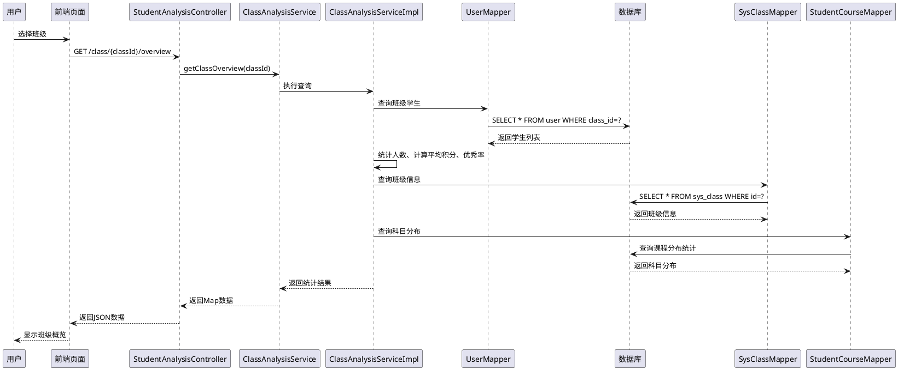
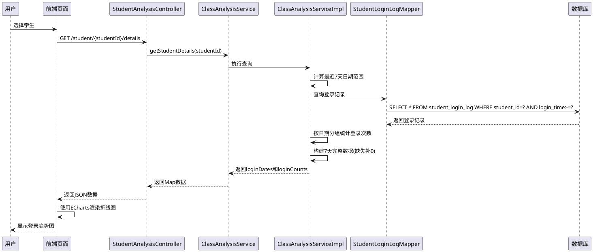
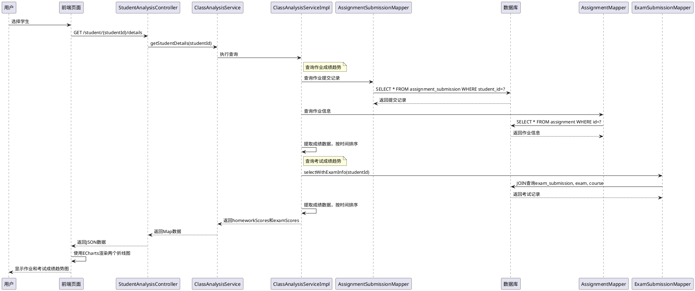
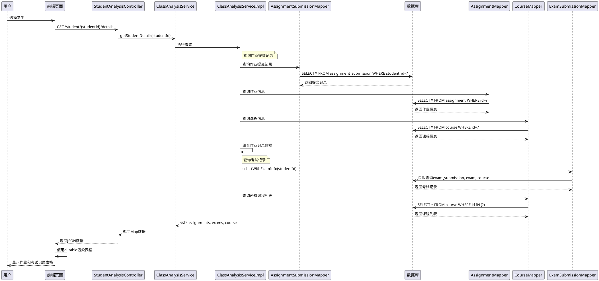
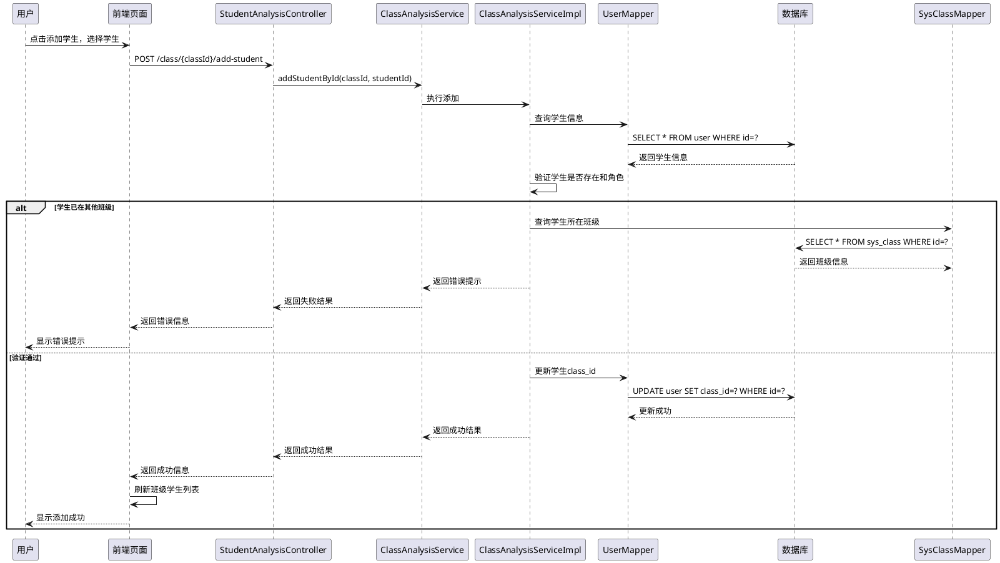
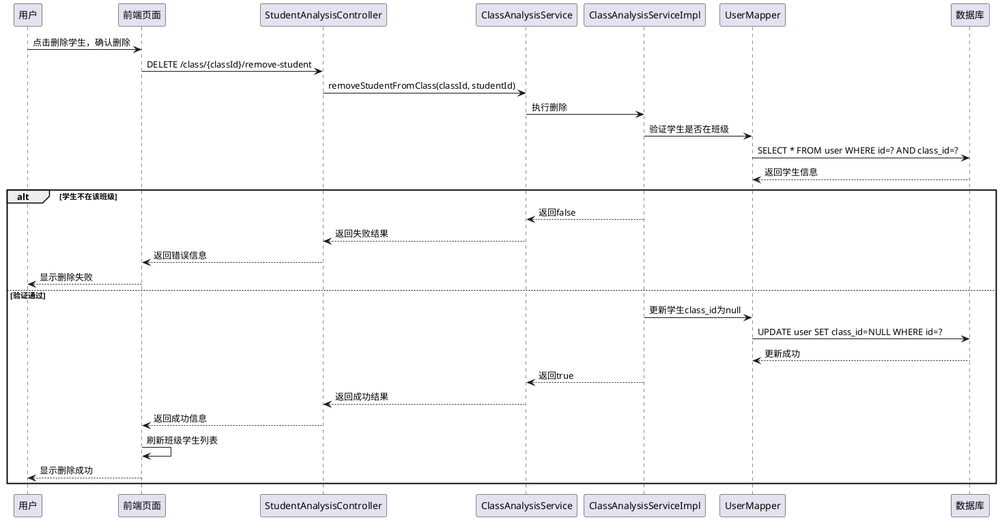
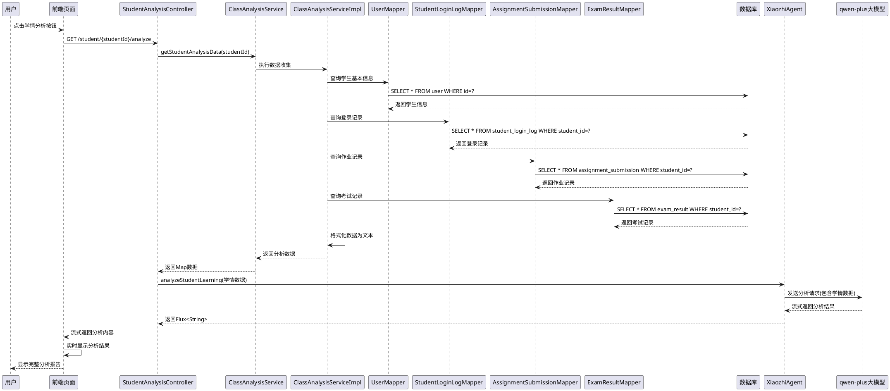

# 智能教育训练系统 - 管理端系统概述及分工说明

## 一、系统概述

### 1.1 系统整体需求

智能教育训练系统管理端是一个面向教育管理者的综合性管理平台，旨在为教育机构提供全方位的教学管理、资源管理、数据分析和决策支持功能。系统采用前后端分离架构，前端基于Vue 3框架开发，后端采用Spring Boot技术栈，实现了高效、稳定、易用的管理界面。

系统核心目标包括：
- **统一管理**：集中管理用户、课程、题库、作业考试等核心教育资源
- **数据可视化**：通过大屏概览实时展示系统运行状态和关键指标
- **智能分析**：基于学情数据提供深度分析和可视化展示
- **流程优化**：简化教学管理流程，提升管理效率

### 1.2 功能模块划分

系统管理端共包含六大核心功能模块：

#### 1.2.1 大屏概览模块
- **功能描述**：采用三栏布局，通过可视化图表展示系统运行状态和关键指标。左侧展示人才发展成果、学生工作图谱和科研效能转化；中间以数字孪生校园地图为核心展示学校概况；右侧展示校园物联感知、学术影响生态和教学管理数据。支持数据实时刷新。

#### 1.2.2 用户管理模块
- **功能描述**：负责系统用户的增删改查与角色权限管理，集中管理教师、学生、管理员等信息，提供用户活跃度、角色分布、性别等统计分析，支持批量操作和操作日志记录。

#### 1.2.3 题库管理模块
- **功能描述**：提供题目高级筛选（科目、类型、题库分类、难度、知识点搜索），展示题目列表（包含ID、科目、内容、类型、难度、知识点及操作选项），并实时显示题库的分类与难度分布统计，便于管理者高效维护和查看题目资源。

#### 1.2.4 作业考试管理模块
- **功能描述**：管理作业和考试任务，支持智能组卷与成绩管理。界面展示任务列表（包含课程、题目、完成率、完成人数、截止时间、状态等信息），提供按课程、教师、学生筛选和标题搜索功能，右侧显示总体完成概览（作业和考试完成率、进行中任务数、即将到期任务）和最近截止时间线，支持任务的编辑和删除操作。

#### 1.2.5 课程资源管理模块
- **功能描述**：管理各类教学资源（课件、视频、文档等），支持资源的上传、查看、下载、修改、入库与删除，可通过课程名称筛选。提供资源总数、入库率、待入库量、下载量等统计概览，以及资源类型分布、热门下载和上传趋势的可视化展示。

#### 1.2.6 学情信息管理模块
- **功能描述**：分析和管理学生学习情况，提供数据驱动的教学决策支持。界面展示班级概览（人数、平均学习积分、优秀率）、班级科目分布、学习行为指标（作业完成率、考试完成率、平均成绩）、班级学习热力图、登录记录趋势图，以及作业提交记录和考试记录表格，支持按班级和学科筛选查看。提供AI智能学情分析功能，基于qwen-plus大模型对学生的登录记录趋势、作业成绩趋势、考试成绩趋势和具体作答详情进行深度分析，生成包含学习行为评估、成绩表现分析、知识掌握情况、学习问题诊断和个性化教学建议的完整分析报告，支持导出为格式规范的Word文档。

## 二、需求分析

### 2.1 功能需求分析

#### 2.1.1 数据字典

系统管理多种类型的业务数据，包括：用户、课程、班级、题目、作业、考试、课程资源、作业提交、考试结果、学生登录日志、操作日志等。每类信息的具体描述如下表所示。

**表2-1 描述用户信息的数据项明细**

| 序号 | 数据项 | 描述 | 约束 |
|------|--------|------|------|
| 1 | id | 用户ID | 主键，自增 |
| 2 | username | 用户名 | 非空，唯一 |
| 3 | password | 密码 | 非空，加密存储 |
| 4 | real_name | 真实姓名 | 非空 |
| 5 | email | 电子邮箱 | 可选，唯一 |
| 6 | role | 角色 | 非空，枚举值：student/teacher/admin |
| 7 | sex | 性别 | 可选，枚举值：男/女 |
| 8 | class | 班级名称 | 可选 |
| 9 | class_id | 班级ID | 外键，关联sys_class表 |
| 10 | school | 学校名称 | 可选 |
| 11 | avatar_url | 头像URL | 可选，阿里云OSS地址 |
| 12 | study_score | 学习积分 | 可选，默认0，整数 |
| 13 | created_at | 创建时间 | 非空，自动生成 |
| 14 | last_login | 最后登录时间 | 可选 |

**表2-2 描述课程信息的数据项明细**

| 序号 | 数据项 | 描述 | 约束 |
|------|--------|------|------|
| 1 | id | 课程ID | 主键，自增 |
| 2 | course_name | 课程名称 | 非空 |
| 3 | course_image | 课程封面图片 | 可选，图片URL |
| 4 | teaching_goal | 教学目标 | 可选，文本 |
| 5 | teaching_principle | 教学原则 | 可选，文本 |
| 6 | course_background | 课程背景 | 可选，文本 |
| 7 | description | 课程描述 | 可选，文本 |
| 8 | teacher_id | 教师ID | 非空，外键，关联user表 |
| 9 | course_intro | 课程简介 | 可选，文本 |
| 10 | created_at | 创建时间 | 非空，自动生成 |

**表2-3 描述班级信息的数据项明细**

| 序号 | 数据项 | 描述 | 约束 |
|------|--------|------|------|
| 1 | id | 班级ID | 主键，自增 |
| 2 | name | 班级名称 | 非空，唯一 |
| 3 | teacher_id | 班主任ID | 非空，外键，关联user表 |
| 4 | created_at | 创建时间 | 非空，自动生成 |

**表2-4 描述题目信息的数据项明细**

| 序号 | 数据项 | 描述 | 约束 |
|------|--------|------|------|
| 1 | id | 题目ID | 主键，自增 |
| 2 | course_id | 课程ID | 非空，外键，关联course表 |
| 3 | type | 题目类型 | 非空，枚举值：choice/short_answer/programming |
| 4 | content | 题目内容 | 非空，文本 |
| 5 | answer | 标准答案 | 非空，文本 |
| 6 | knowledge_point | 知识点 | 可选，文本 |
| 7 | difficulty_level | 难度等级 | 可选，枚举值：easy/medium/hard |
| 8 | category_id | 分类ID | 可选，外键，关联question_bank_category表 |
| 9 | estimated_time_minutes | 预估答题时间 | 可选，整数（分钟） |
| 10 | tags | 题目标签 | 可选，逗号分隔的字符串 |
| 11 | is_ai_generated | 是否AI生成 | 可选，布尔值，默认false |
| 12 | generation_prompt | AI生成提示词 | 可选，文本 |
| 13 | quality_score | 题目质量评分 | 可选，浮点数，0-10分 |
| 14 | created_by | 创建者ID | 可选，外键，关联user表 |
| 15 | created_at | 创建时间 | 非空，自动生成 |

**表2-5 描述作业信息的数据项明细**

| 序号 | 数据项 | 描述 | 约束 |
|------|--------|------|------|
| 1 | id | 作业ID | 主键，自增 |
| 2 | course_id | 课程ID | 非空，外键，关联course表 |
| 3 | teacher_id | 教师ID | 非空，外键，关联user表 |
| 4 | title | 作业标题 | 非空 |
| 5 | description | 作业描述 | 可选，文本 |
| 6 | due_date | 截止日期 | 非空，日期格式 |
| 7 | created_at | 创建时间 | 非空，自动生成 |

**表2-6 描述考试信息的数据项明细**

| 序号 | 数据项 | 描述 | 约束 |
|------|--------|------|------|
| 1 | id | 考试ID | 主键，自增 |
| 2 | course_id | 课程ID | 非空，外键，关联course表 |
| 3 | teacher_id | 教师ID | 非空，外键，关联user表 |
| 4 | title | 考试标题 | 非空 |
| 5 | description | 考试描述 | 可选，文本 |
| 6 | exam_date | 考试日期 | 非空，日期格式 |
| 7 | duration_minutes | 考试时长 | 可选，整数（分钟） |
| 8 | created_at | 创建时间 | 非空，自动生成 |

**表2-7 描述课程资源信息的数据项明细**

| 序号 | 数据项 | 描述 | 约束 |
|------|--------|------|------|
| 1 | id | 资源ID | 主键，自增 |
| 2 | course_id | 课程ID | 非空，外键，关联course表 |
| 3 | teacher_id | 教师ID | 非空，外键，关联user表 |
| 4 | file_name | 文件名称 | 非空 |
| 5 | file_path | 文件路径 | 非空，存储路径或URL |
| 6 | uploaded_at | 上传时间 | 非空，自动生成 |
| 7 | download_count | 下载次数 | 可选，整数，默认0 |
| 8 | is_ingested | 是否已入库 | 可选，布尔值，默认false |

**表2-8 描述作业提交信息的数据项明细**

| 序号 | 数据项 | 描述 | 约束 |
|------|--------|------|------|
| 1 | id | 提交ID | 主键，自增 |
| 2 | assignment_id | 作业ID | 非空，外键，关联assignment表 |
| 3 | student_id | 学生ID | 非空，外键，关联user表 |
| 4 | submitted_at | 提交时间 | 非空，时间戳 |
| 5 | content | 提交内容 | 可选，文本或JSON格式 |
| 6 | score | 得分 | 可选，整数，0-100 |
| 7 | is_late | 是否迟交 | 可选，布尔值，默认false |

**表2-9 描述考试结果信息的数据项明细**

| 序号 | 数据项 | 描述 | 约束 |
|------|--------|------|------|
| 1 | id | 结果ID | 主键，自增 |
| 2 | exam_id | 考试ID | 非空，外键，关联exam表 |
| 3 | student_id | 学生ID | 非空，外键，关联user表 |
| 4 | total_questions | 总题数 | 可选，整数 |
| 5 | correct_answers | 正确题数 | 可选，整数 |
| 6 | wrong_answers | 错误题数 | 可选，整数 |
| 7 | score | 总分 | 可选，浮点数 |
| 8 | status | 状态 | 可选，枚举值：submitted/graded/reviewed |
| 9 | ai_feedback | AI批阅反馈 | 可选，文本 |
| 10 | submitted_at | 提交时间 | 可选，时间戳 |
| 11 | graded_at | 批阅时间 | 可选，时间戳 |
| 12 | created_at | 创建时间 | 非空，自动生成 |

**表2-10 描述学生登录日志信息的数据项明细**

| 序号 | 数据项 | 描述 | 约束 |
|------|--------|------|------|
| 1 | id | 日志ID | 主键，自增 |
| 2 | student_id | 学生ID | 非空，外键，关联user表 |
| 3 | login_time | 登录时间 | 非空，时间戳 |

**表2-11 描述操作日志信息的数据项明细**

| 序号 | 数据项 | 描述 | 约束 |
|------|--------|------|------|
| 1 | id | 日志ID | 主键，自增 |
| 2 | user_id | 用户ID | 非空，外键，关联user表 |
| 3 | username | 用户名 | 非空 |
| 4 | operation_type | 操作类型 | 非空，枚举值：CREATE/UPDATE/DELETE/QUERY |
| 5 | table_name | 操作表名 | 非空 |
| 6 | record_id | 记录ID | 可选 |
| 7 | operation_desc | 操作描述 | 可选，文本 |
| 8 | request_method | 请求方法 | 可选，枚举值：GET/POST/PUT/DELETE |
| 9 | request_url | 请求URL | 可选 |
| 10 | request_params | 请求参数 | 可选，JSON格式 |
| 11 | ip_address | IP地址 | 可选 |
| 12 | user_agent | 用户代理 | 可选 |
| 13 | operation_time | 操作时间 | 非空，时间戳 |
| 14 | status | 操作状态 | 可选，枚举值：SUCCESS/FAILED |
| 15 | error_message | 错误信息 | 可选，文本 |

#### 2.1.2 数据流图

**顶层数据流图（0层DFD）**：
系统顶层数据流图包含以下外部实体和数据流：
- **外部实体**：管理员、教师、学生、数据库、文件存储系统
- **主要数据流**：
  - 管理员 → 系统：用户管理请求、题库管理请求、作业考试管理请求、资源管理请求、学情查询请求
  - 系统 → 管理员：用户列表、题目列表、作业考试列表、资源列表、学情分析报告
  - 系统 → 数据库：数据查询请求、数据更新请求
  - 数据库 → 系统：查询结果、更新结果
  - 系统 → 文件存储系统：文件上传请求、文件下载请求
  - 文件存储系统 → 系统：文件存储结果、文件内容

**0层数据流图（系统分解）**：
系统分解为以下主要处理过程：
1. **P1：用户管理处理**：接收用户管理请求，进行用户信息增删改查、权限管理、统计分析
2. **P2：题库管理处理**：接收题目管理请求，进行题目录入、审核、分类、统计
3. **P3：作业考试管理处理**：接收作业考试管理请求，进行创建、组卷、发布、成绩统计
4. **P4：资源管理处理**：接收资源管理请求，进行资源上传、存储、入库、统计
5. **P5：学情分析处理**：接收学情查询请求，进行数据采集、统计计算、可视化展示
6. **P6：大屏概览处理**：接收数据查询请求，进行数据汇总、图表生成、实时刷新

**1层数据流图（详细数据流）**：

**用户管理数据流（P1详细分解）**：
- 用户信息输入 → P1.1用户信息验证 → P1.2数据库操作 → 用户表存储 → P1.3权限验证 → P1.4用户列表生成 → 用户列表展示
- 用户查询请求 → P1.5数据查询 → 用户表 → 查询结果 → P1.6统计分析 → 统计结果展示

**题库管理数据流（P2详细分解）**：
- 题目录入/导入 → P2.1题目信息验证 → P2.2题目分类处理 → P2.3数据库存储 → 题目表 → P2.4题目列表生成 → 题目列表展示
- 题目筛选请求 → P2.5筛选处理 → 题目表 → 筛选结果 → 题目列表展示
- 题目统计请求 → P2.6统计计算 → 题目表 → 统计结果 → 图表展示

**作业考试管理数据流（P3详细分解）**：
- 作业/考试创建 → P3.1任务信息验证 → P3.2智能组卷算法 → 题目表 → 题目筛选 → P3.3试卷生成 → 作业考试表存储 → P3.4任务列表生成 → 任务列表展示
- 成绩统计请求 → P3.5成绩数据采集 → 答题记录表 → P3.6成绩计算 → 统计结果 → 成绩分析展示

**资源管理数据流（P4详细分解）**：
- 资源上传 → P4.1文件验证 → P4.2文件存储 → 文件存储系统 → 存储结果 → P4.3资源信息入库 → 资源表 → P4.4资源列表生成 → 资源列表展示
- 资源查询请求 → P4.5资源查询 → 资源表 → 查询结果 → 资源列表展示
- 资源统计请求 → P4.6资源统计 → 资源表 → 统计结果 → 图表展示

**学情分析数据流（P5详细分解）**：
- 学情查询请求 → P5.1数据采集 → 学习记录表、成绩表 → P5.2数据统计计算 → 统计结果 → P5.3可视化处理 → 图表数据 → P5.4图表渲染 → 学情分析展示
- 学情报告生成 → P5.5报告数据汇总 → P5.6报告格式化 → 报告文件生成

**大屏概览数据流（P6详细分解）**：
- 数据查询请求 → P6.1多源数据采集 → 用户表、题目表、资源表、学习记录表 → P6.2数据汇总计算 → 汇总数据 → P6.3图表配置生成 → 图表数据 → P6.4实时刷新机制 → 大屏展示

#### 2.1.3 功能需求清单

**大屏概览模块功能需求**：
- FR-001：支持三栏布局展示系统关键指标
- FR-002：实时展示人才发展成果统计（饼图、环形图）
- FR-003：展示学生工作图谱（柱状图，近五年数据趋势）
- FR-004：展示科研效能转化进度（环形进度条）
- FR-005：展示数字孪生校园地图及学校概况
- FR-006：支持数据实时刷新（定时更新、手动刷新）

**用户管理模块功能需求**：
- FR-007：支持用户信息的增删改查操作
- FR-008：支持用户角色权限管理（管理员/教师/学生）
- FR-009：支持用户状态管理（启用/禁用）
- FR-010：支持用户批量导入导出（Excel格式）
- FR-011：提供用户活跃度、角色分布、性别等统计分析

**题库管理模块功能需求**：
- FR-012：支持题目高级筛选（科目、类型、难度、知识点）
- FR-013：支持题目增删改查操作
- FR-014：支持题目批量导入导出
- FR-015：实时显示题库分类与难度分布统计

**作业考试管理模块功能需求**：
- FR-016：支持作业/考试创建与编辑
- FR-017：支持智能组卷功能（按难度、题型、数量自动生成）
- FR-018：支持作业/考试发布与管理
- FR-019：支持成绩统计与分析（完成率、平均分、及格率等）
- FR-020：展示总体完成概览和最近截止时间线

**课程资源管理模块功能需求**：
- FR-021：支持资源上传、查看、下载、修改、删除
- FR-022：支持资源入库管理
- FR-023：支持按课程名称筛选资源
- FR-024：提供资源统计概览（总数、入库率、下载量等）
- FR-025：展示资源类型分布和上传趋势

**学情信息管理模块功能需求**：
- FR-026：展示班级概览（人数、平均学习积分、优秀率）
- FR-027：展示班级科目分布（饼图）
- FR-028：展示学习行为指标（完成率、平均成绩）
- FR-029：展示班级学习热力图
- FR-030：展示登录记录、作业成绩、考试成绩趋势图
- FR-031：支持按班级和学科筛选查看
- FR-032：提供AI智能学情分析功能，基于大模型分析学生学习情况
- FR-033：支持学情分析报告导出为Word文档

### 2.2 功能需求

#### 2.2.1 用户类型

智能教育训练系统管理端面向三类用户：

1. **管理员（Admin）**：系统最高权限用户，负责系统整体管理和维护，拥有所有功能模块的访问权限，包括用户管理、题库管理、作业考试管理、课程资源管理、学情信息查看和大屏概览查看等。

2. **教师（Teacher）**：教学活动的组织者和执行者，可以创建和管理课程、发布作业和考试、上传教学资源、查看学生学情信息，但无法进行系统级别的用户管理和全局数据查看。

3. **学生（Student）**：系统的学习主体，主要使用学生端系统进行学习活动，在管理端中作为被管理对象，其学习数据、作业提交、考试成绩等信息被教师和管理员查看和分析。

#### 2.2.2 功能模块

系统管理端共包含六大核心功能模块：

1. **大屏概览模块**：采用三栏布局设计，通过可视化图表实时展示系统运行状态和关键指标，包括人才发展成果统计、学生工作图谱、科研效能转化、数字孪生校园地图、校园物联感知、学术影响生态和教学管理数据等，支持数据实时刷新功能。

2. **用户管理模块**：负责系统用户的增删改查与角色权限管理，集中管理教师、学生、管理员等用户信息，提供用户活跃度、角色分布、性别等统计分析功能，支持批量导入导出和操作日志记录。

3. **题库管理模块**：提供题目的高级筛选、增删改查、批量导入导出等功能，支持按科目、类型、难度、知识点等多维度筛选，实时显示题库的分类与难度分布统计，便于管理者高效维护和查看题目资源。

4. **作业考试管理模块**：管理作业和考试任务，支持智能组卷与成绩管理，界面展示任务列表和总体完成概览，提供按课程、教师、学生筛选和标题搜索功能，支持任务的创建、编辑、删除和成绩统计分析。

5. **课程资源管理模块**：管理各类教学资源（课件、视频、文档等），支持资源的上传、查看、下载、修改、入库与删除，可通过课程名称筛选，提供资源统计概览和可视化展示。

6. **学情信息管理模块**：分析和管理学生学习情况，提供数据驱动的教学决策支持，包括班级概览、学习行为指标、班级学习热力图、登录记录趋势图、作业提交记录和考试记录等，支持AI智能学情分析和Word报告导出功能。

#### 2.2.3 功能用例图

**图2-1 智能教育训练系统管理端功能用例图**

```
                    ┌─────────────────────────────────────┐
                    │    智能教育训练系统管理端            │
                    └─────────────────────────────────────┘
                              │
        ┌─────────────────────┼─────────────────────┐
        │                     │                     │
    ┌───▼───┐            ┌───▼───┐            ┌───▼───┐
    │管理员 │            │ 教师  │            │ 学生  │
    └───┬───┘            └───┬───┘            └───┬───┘
        │                     │                     │
        ├─ 大屏概览查看       │                     │
        ├─ 用户管理           │                     │
        ├─ 题库管理           ├─ 题库查看           │
        ├─ 作业考试管理       ├─ 作业考试管理       │
        ├─ 课程资源管理       ├─ 课程资源管理       │
        ├─ 学情信息查看       ├─ 学情信息查看       │
        └─ 系统配置           └─ 课程管理           │
                                                    │
                                                    └─ 学习数据记录
```

**用例说明**：
- **管理员用例**：大屏概览查看、用户管理、题库管理、作业考试管理、课程资源管理、学情信息查看、系统配置
- **教师用例**：题库查看、作业考试管理、课程资源管理、学情信息查看、课程管理
- **学生用例**：学习数据记录（学生端功能，在管理端中作为数据源）

#### 2.2.4 特殊功能要求

**1. AI智能学情分析功能**
- 系统集成qwen-plus大模型，基于学生的登录记录趋势、作业成绩趋势、考试成绩趋势和具体作答详情进行深度分析
- 自动生成包含学习行为评估、成绩表现分析、知识掌握情况、学习问题诊断和个性化教学建议的完整分析报告
- 支持流式数据传输，实时展示AI分析结果，提升用户体验
- 支持将分析报告导出为格式规范的Word文档，便于保存和分享

**2. 智能组卷功能**
- 支持按难度、题型、数量等条件自动生成试卷
- 可根据知识点分布和难度要求智能筛选题目
- 支持试卷预览和编辑，确保试卷质量

**3. 数据可视化功能**
- 大屏概览模块采用ECharts图表库，支持多种图表类型（饼图、柱状图、折线图、热力图等）
- 支持数据实时刷新，默认刷新间隔30秒，可配置
- 响应式布局设计，适配不同屏幕尺寸

**4. 批量操作功能**
- 支持用户批量导入导出（Excel格式）
- 支持题目批量导入导出
- 支持批量数据处理和统计分析

#### 2.2.5 性能要求

系统在响应时间方面有严格要求。系统首页加载时间应小于3秒，确保用户能够快速进入系统。普通查询操作响应时间应小于2秒，复杂统计查询响应时间应小于5秒，保证数据查询的及时性。ECharts图表渲染时间应小于1秒，确保数据可视化展示的流畅性。单个文件上传响应时间应小于10秒（文件大小<100MB），满足教学资源上传的效率需求。

在并发性能方面，系统应支持至少100个并发用户同时访问，满足多用户同时使用的场景。系统支持至少50个并发数据库连接，保证数据库访问的稳定性。单个API接口应支持至少200次/秒的并发请求，确保接口的高可用性。

在数据处理性能方面，大屏概览数据刷新间隔可配置，默认30秒，支持实时数据展示。系统支持批量导入至少1000条记录，满足大批量数据导入的需求。系统支持对至少10万条记录进行统计分析，保证数据分析的准确性。系统支持至少100万条用户数据、50万条题目数据的高效查询，确保系统在大数据量下的性能表现。

在系统资源方面，建议服务器配置为CPU 4核以上、内存8GB以上，为系统运行提供充足的硬件资源。系统支持至少1TB的教学资源文件存储，满足大量教学资源的存储需求。

#### 2.2.6 安全要求

系统采用基于角色的访问控制（RBAC）机制，不同角色用户只能访问和操作授权范围内的数据。管理员拥有所有功能模块的访问权限，可以进行系统级别的管理和维护。教师只能访问与其相关的课程、作业、考试和学情信息，保证数据访问的合理性。所有用户操作必须经过身份认证和权限验证，确保系统访问的安全性。

在数据安全方面，用户密码必须加密存储，采用安全的哈希算法（如BCrypt），防止密码泄露。敏感信息（如密码、个人隐私信息）在传输过程中必须使用HTTPS加密，保证数据传输的安全性。数据库连接使用连接池，防止SQL注入攻击，确保数据库访问安全。所有用户输入必须进行前后端双重数据校验，防止XSS攻击和CSRF攻击，保护系统免受恶意攻击。

系统记录所有关键操作的日志，包括操作类型、操作时间、操作用户、操作内容等，实现完整的操作审计。操作日志支持查询和导出，便于审计和追溯，满足合规性要求。异常操作和错误信息记录在操作日志中，便于问题排查和系统维护。

系统定期备份数据库，确保数据可恢复，防止因系统故障导致的数据丢失。系统支持数据备份和恢复功能，关键数据支持增量备份和全量备份，保证数据的安全性和可恢复性。

系统应具备完善的异常处理机制，避免因异常导致数据丢失，保证系统的稳定性。关键操作（如用户创建、题目删除）必须使用事务保证数据一致性，确保数据的完整性。系统应具备容错能力，单个模块故障不影响整体系统运行，提高系统的可靠性。

### 2.3 性能需求分析

#### 2.2.1 响应时间需求
- **页面加载时间**：系统首页加载时间应小于3秒
- **数据查询响应**：普通查询操作响应时间应小于2秒，复杂统计查询应小于5秒
- **图表渲染时间**：ECharts图表渲染时间应小于1秒
- **文件上传响应**：单个文件上传响应时间应小于10秒（文件大小<100MB）

#### 2.2.2 并发性能需求
- **并发用户数**：系统应支持至少100个并发用户同时访问
- **数据库连接**：支持至少50个并发数据库连接
- **接口并发**：单个API接口应支持至少200次/秒的并发请求

#### 2.2.3 数据处理性能需求
- **数据刷新频率**：大屏概览数据刷新间隔可配置，默认30秒
- **批量操作**：支持批量导入至少1000条记录
- **数据统计**：支持对至少10万条记录进行统计分析

#### 2.2.4 系统资源需求
- **服务器配置**：建议CPU 4核以上，内存8GB以上
- **数据库性能**：支持至少100万条用户数据、50万条题目数据的高效查询
- **存储空间**：支持至少1TB的教学资源文件存储

### 2.4 完整性需求分析

#### 2.3.1 数据完整性需求
- **实体完整性**：所有数据表必须设置主键，确保每条记录唯一标识
- **参照完整性**：外键约束确保数据关联的一致性（如用户ID、课程ID等）
- **域完整性**：字段数据类型、长度、取值范围必须符合业务规则
- **业务完整性**：关键业务数据必须满足业务规则（如作业截止时间必须晚于创建时间）

#### 2.3.2 数据一致性需求
- **事务一致性**：关键操作（如用户创建、题目删除）必须使用事务保证数据一致性
- **缓存一致性**：缓存数据与数据库数据保持一致，设置合理的缓存过期策略
- **分布式一致性**：前后端数据交互必须保证数据格式和内容的一致性

#### 2.3.3 数据安全完整性需求
- **访问控制**：不同角色用户只能访问和操作授权范围内的数据
- **数据备份**：定期备份数据库，确保数据可恢复
- **操作日志**：记录关键操作日志，支持数据追溯
- **数据加密**：敏感信息（如密码）必须加密存储

#### 2.3.4 系统完整性需求
- **异常处理**：系统应具备完善的异常处理机制，避免因异常导致数据丢失
- **数据校验**：前端和后端双重数据校验，确保数据有效性
- **容错机制**：系统应具备容错能力，单个模块故障不影响整体系统运行

### 2.5 UML建模

#### 2.4.1 用例图
系统主要参与者包括：管理员、教师、学生。核心用例包括：
- 用户管理（管理员）
- 题库管理（管理员）
- 作业考试管理（管理员、教师）
- 课程资源管理（管理员、教师）
- 学情信息查看（管理员、教师）
- 大屏概览查看（管理员）

#### 2.4.2 类图

根据前面的需求分析，本系统相关的实体有6个，分别是：用户、班级、课程、题目、作业、考试。其中，用户包括用户ID、用户名、密码、真实姓名、角色（管理员/教师/学生）、性别、班级ID、学校、头像URL、学习积分、创建时间、最后登录时间等；班级包括班级ID、班级名称、班主任ID、创建时间等；课程包括课程ID、课程名称、课程封面图片、教学目标、教学原则、课程背景、课程描述、教师ID、课程简介、创建时间等；题目包括题目ID、课程ID、题目类型（选择题/简答题/编程题）、题目内容、标准答案、知识点、难度等级、分类ID、预估答题时间、题目标签、是否AI生成、创建者ID、创建时间等；作业包括作业ID、课程ID、教师ID、作业标题、作业描述、截止日期、创建时间等；考试包括考试ID、课程ID、教师ID、考试标题、考试描述、考试日期、考试时长、创建时间等。

一个班级有多个学生，一个学生只能属于一个班级，班级由班主任（教师）管理。一个教师可以创建多个课程，一个课程只能由一个教师创建，课程ID是课程的唯一标识。一个课程可以包含多个题目，一个题目只能属于一个课程，题目ID是题目的唯一标识。一个课程可以发布多个作业和多个考试，一个作业或考试只能属于一个课程。学生完成作业后需要提交作业内容，系统记录作业提交信息（提交时间、得分、是否迟交等）；学生参加考试后，系统记录考试结果信息（总题数、正确题数、错误题数、得分、AI批阅反馈等）。此外，系统还记录学生的登录日志和所有用户的操作日志，用于数据分析和审计追溯。

#### 2.4.3 时序图
主要业务流程时序图包括：
- 用户登录流程：用户输入 → 前端验证 → 后端验证 → 数据库查询 → 返回结果
- 题目管理流程：题目录入 → 数据校验 → 数据库存储 → 列表更新
- 智能组卷流程：参数设置 → 算法计算 → 题目筛选 → 试卷生成 → 预览确认

## 三、小组分工情况

### 3.1 团队成员及职责

本系统开发团队由4名成员组成，采用模块化分工方式，每位成员负责特定功能模块的设计与开发工作。张政负责大屏概览模块和学情信息管理模块；李东楷负责题库管理模块和作业考试管理模块；梁本华负责课程资源管理模块；王子平负责用户管理模块。

#### 3.1.1 张政 - 大屏概览与学情信息管理

在系统设计和开发过程中，我主要负责大屏概览模块和学情信息管理模块的完整设计与开发工作。在大屏概览模块中，我深入分析管理端数据展示需求，设计了三栏布局的大屏展示方案，使用Vue 3框架和ECharts图表库实现了人才发展成果统计图表、学生工作图谱、科研效能转化进度展示、数字孪生校园地图等核心功能，并开发了数据实时刷新机制和响应式布局，确保大屏展示效果流畅。在学情信息管理模块中，我设计了学情数据分析维度和数据结构，实现了班级概览、学习行为指标、班级学习热力图、登录记录趋势图等可视化展示功能，开发了数据统计计算、对比分析和多维度筛选查询功能，并优化了数据加载性能和用户体验。此外，我还开发了AI智能学情分析功能，集成qwen-plus大模型，实现了基于学生登录记录、作业成绩、考试成绩和具体作答详情的智能分析，设计了包含学习行为评估、成绩表现分析、知识掌握情况、学习问题诊断和个性化教学建议的完整分析报告生成机制，并实现了流式数据展示和Word文档导出功能，使用Apache POI技术生成格式规范的学情分析报告文档。通过以上工作，我成功完成了两个模块的设计与开发，为系统提供了直观的数据可视化展示和深度的学情分析功能，帮助管理者快速掌握学校整体运营状况和学生学习情况，为教学决策提供数据支持。

### 3.2 协作机制

1. **接口规范统一**：团队成员共同制定前后端接口规范，确保数据交互一致性
2. **代码规范**：遵循统一的代码风格和命名规范，便于代码维护
3. **版本控制**：使用Git进行版本管理，采用分支开发策略
4. **定期沟通**：定期进行进度同步和技术讨论，及时解决开发中的问题
5. **测试协作**：各模块开发完成后进行联调测试，确保系统整体功能正常

### 3.3 技术栈

- **前端框架**：Vue 3 + Element Plus
- **图表库**：ECharts
- **构建工具**：Vite
- **后端框架**：Spring Boot
- **数据库**：MySQL + MongoDB
- **版本控制**：Git

## 四、SQL实现

### 4.3 SQL实现

#### 4.3.1 大屏概览模块SQL实现

**1. 人才发展成果统计查询**

```sql
-- 按学科门类统计人才发展成果
SELECT 
    CASE 
        WHEN u.class LIKE '%工学%' OR u.class LIKE '%工程%' THEN '工学'
        WHEN u.class LIKE '%理学%' OR u.class LIKE '%数学%' THEN '理学'
        WHEN u.class LIKE '%管理%' THEN '管理学'
        WHEN u.class LIKE '%文学%' OR u.class LIKE '%语言%' THEN '文学'
        WHEN u.class LIKE '%艺术%' THEN '艺术学'
        ELSE '其他'
    END AS subject_type,
    COUNT(*) AS count,
    ROUND(COUNT(*) * 100.0 / (SELECT COUNT(*) FROM user WHERE role = 'student'), 2) AS percentage
FROM user u
WHERE u.role = 'student'
GROUP BY subject_type
ORDER BY count DESC;
```

**2. 学生工作图谱数据查询（近五年招生、在校、毕业数据）**

```sql
-- 查询近五年学生工作数据
SELECT 
    YEAR(created_at) AS year,
    COUNT(*) AS enrollment_count,
    (SELECT COUNT(*) FROM user WHERE role = 'student' AND YEAR(created_at) <= YEAR(u.created_at)) AS in_school_count,
    (SELECT COUNT(*) FROM user WHERE role = 'student' AND YEAR(created_at) = YEAR(u.created_at) - 4) AS graduation_count
FROM user u
WHERE u.role = 'student' 
    AND YEAR(created_at) >= YEAR(CURDATE()) - 4
GROUP BY YEAR(created_at)
ORDER BY year;
```

**3. 科研效能转化统计查询**

```sql
-- 统计科研效能转化数据
SELECT 
    COUNT(DISTINCT er.exam_id) AS national_projects,
    COUNT(DISTINCT a.id) AS total_projects,
    ROUND(AVG(er.total_score), 2) AS avg_score,
    ROUND(COUNT(DISTINCT CASE WHEN er.total_score >= 60 THEN er.id END) * 100.0 / COUNT(DISTINCT er.id), 2) AS conversion_rate
FROM exam_result er
LEFT JOIN exam e ON er.exam_id = e.id
LEFT JOIN assignment a ON e.course_id = a.course_id
WHERE er.created_at >= DATE_SUB(CURDATE(), INTERVAL 1 YEAR);
```

**4. 系统关键指标实时统计查询**

```sql
-- 获取系统关键指标
SELECT 
    (SELECT COUNT(*) FROM user WHERE role = 'student') AS total_students,
    (SELECT COUNT(*) FROM user WHERE role = 'teacher') AS total_teachers,
    (SELECT COUNT(*) FROM course) AS total_courses,
    (SELECT COUNT(*) FROM question_bank) AS total_questions,
    (SELECT COUNT(*) FROM assignment WHERE due_date >= CURDATE()) AS ongoing_assignments,
    (SELECT COUNT(*) FROM exam WHERE exam_date >= CURDATE()) AS upcoming_exams
FROM DUAL;
```

**5. 校园物联感知数据查询**

```sql
-- 校园基础设施统计（示例数据，实际应从IoT系统获取）
SELECT 
    '占地面积' AS item_name,
    '2600亩' AS value
UNION ALL
SELECT '校舍面积', '102万㎡'
UNION ALL
SELECT '学院数量', CONCAT((SELECT COUNT(DISTINCT class) FROM user WHERE class IS NOT NULL), '个')
UNION ALL
SELECT '馆藏图书', '377.57万';
```

**6. 大屏数据实时刷新存储过程**

```sql
DELIMITER $$

CREATE PROCEDURE sp_refresh_overview_data()
BEGIN
    -- 更新统计概览表
    INSERT INTO stat_overview (date, active_teachers, active_students, total_questions, avg_correct_rate)
    SELECT 
        CURDATE(),
        (SELECT COUNT(DISTINCT teacher_id) FROM assignment WHERE DATE(created_at) = CURDATE()),
        (SELECT COUNT(DISTINCT student_id) FROM student_login_log WHERE DATE(login_time) = CURDATE()),
        (SELECT COUNT(*) FROM question_bank),
        (SELECT ROUND(AVG(CASE WHEN is_correct = 1 THEN 100 ELSE 0 END), 2) 
         FROM exam_answer WHERE DATE(created_at) = CURDATE())
    ON DUPLICATE KEY UPDATE
        active_teachers = VALUES(active_teachers),
        active_students = VALUES(active_students),
        total_questions = VALUES(total_questions),
        avg_correct_rate = VALUES(avg_correct_rate);
END$$

DELIMITER ;
```

#### 4.3.2 学情信息管理模块SQL实现

**1. 添加学生到班级**

```sql
-- 将学生添加到指定班级
UPDATE user 
SET class_id = ?,  -- 班级ID参数
    class = (SELECT name FROM sys_class WHERE id = ?)  -- 班级名称
WHERE id = ?  -- 学生ID参数
    AND role = 'student';
```

**2. 移除学生出班级**

```sql
-- 将学生从班级中移除
UPDATE user 
SET class_id = NULL,
    class = NULL
WHERE id = ?  -- 学生ID参数
    AND role = 'student'
    AND class_id = ?;  -- 班级ID参数（确保只移除指定班级的学生）
```

**3. 班级概览数据查询**

```sql
-- 查询班级概览信息（人数、平均学习积分、优秀率）
SELECT 
    c.id AS class_id,
    c.name AS class_name,
    c.teacher_id,
    u.real_name AS teacher_name,
    COUNT(DISTINCT s.id) AS student_count,
    ROUND(AVG(s.study_score), 1) AS avg_study_score,
    ROUND(COUNT(CASE WHEN s.study_score >= 80 THEN 1 END) * 100.0 / COUNT(*), 1) AS excellence_rate
FROM sys_class c
LEFT JOIN user u ON c.teacher_id = u.id
LEFT JOIN user s ON s.class_id = c.id AND s.role = 'student'
WHERE c.id = ?  -- 班级ID参数
GROUP BY c.id, c.name, c.teacher_id, u.real_name;
```

**4. 班级科目分布统计查询**

```sql
-- 查询班级科目分布（饼图数据）
SELECT 
    co.name AS course_name,
    COUNT(DISTINCT sc.student_id) AS student_count,
    ROUND(COUNT(DISTINCT sc.student_id) * 100.0 / 
        (SELECT COUNT(*) FROM user WHERE class_id = ? AND role = 'student'), 2) AS percentage
FROM student_course sc
JOIN course co ON sc.course_id = co.id
JOIN user u ON sc.student_id = u.id
WHERE u.class_id = ?  -- 班级ID参数
GROUP BY co.id, co.name
ORDER BY student_count DESC;
```

**5. 学习行为指标统计查询**

```sql
-- 查询学习行为指标（作业完成率、考试完成率、平均成绩）
SELECT 
    u.id AS student_id,
    u.real_name AS student_name,
    u.class_id,
    -- 作业完成率
    ROUND(COUNT(DISTINCT CASE WHEN asub.id IS NOT NULL THEN a.id END) * 100.0 / 
        COUNT(DISTINCT a.id), 2) AS homework_completion_rate,
    -- 考试完成率
    ROUND(COUNT(DISTINCT CASE WHEN er.id IS NOT NULL THEN e.id END) * 100.0 / 
        COUNT(DISTINCT e.id), 2) AS exam_completion_rate,
    -- 作业平均成绩
    ROUND(AVG(asub.score), 1) AS avg_homework_score,
    -- 考试平均成绩
    ROUND(AVG(er.total_score), 1) AS avg_exam_score
FROM user u
LEFT JOIN student_course sc ON u.id = sc.student_id
LEFT JOIN assignment a ON sc.course_id = a.course_id
LEFT JOIN assignment_submission asub ON a.id = asub.assignment_id AND u.id = asub.student_id
LEFT JOIN exam e ON sc.course_id = e.course_id
LEFT JOIN exam_result er ON e.id = er.exam_id AND u.id = er.student_id
WHERE u.role = 'student' 
    AND (u.class_id = ? OR ? IS NULL)  -- 班级ID参数，可为空
    AND (sc.course_id = ? OR ? IS NULL)  -- 课程ID参数，可为空
GROUP BY u.id, u.real_name, u.class_id;
```

**6. 登录记录趋势查询**

```sql
-- 查询登录记录趋势（最近7天）
SELECT 
    DATE(login_time) AS login_date,
    COUNT(DISTINCT student_id) AS login_count
FROM student_login_log
WHERE login_time >= DATE_SUB(CURDATE(), INTERVAL 7 DAY)
    AND (student_id IN (SELECT id FROM user WHERE class_id = ?) OR ? IS NULL)  -- 班级ID参数
GROUP BY DATE(login_time)
ORDER BY login_date;
```

**7. 作业成绩趋势查询**

```sql
-- 查询作业成绩趋势
SELECT 
    DATE(asub.submitted_at) AS submit_date,
    ROUND(AVG(asub.score), 1) AS avg_score,
    COUNT(*) AS submission_count
FROM assignment_submission asub
JOIN assignment a ON asub.assignment_id = a.id
JOIN user u ON asub.student_id = u.id
WHERE asub.submitted_at >= DATE_SUB(CURDATE(), INTERVAL 30 DAY)
    AND (u.class_id = ? OR ? IS NULL)  -- 班级ID参数
    AND (a.course_id = ? OR ? IS NULL)  -- 课程ID参数
GROUP BY DATE(asub.submitted_at)
ORDER BY submit_date;
```

**8. 考试成绩趋势查询**

```sql
-- 查询考试成绩趋势
SELECT 
    DATE(er.created_at) AS exam_date,
    ROUND(AVG(er.total_score), 1) AS avg_score,
    COUNT(*) AS exam_count
FROM exam_result er
JOIN exam e ON er.exam_id = e.id
JOIN user u ON er.student_id = u.id
WHERE er.created_at >= DATE_SUB(CURDATE(), INTERVAL 30 DAY)
    AND (u.class_id = ? OR ? IS NULL)  -- 班级ID参数
    AND (e.course_id = ? OR ? IS NULL)  -- 课程ID参数
GROUP BY DATE(er.created_at)
ORDER BY exam_date;
```

**9. 班级学习热力图数据查询**

```sql
-- 查询学生活跃度数据（用于热力图）
SELECT 
    u.id AS student_id,
    u.real_name AS student_name,
    u.avatar_url,
    COALESCE(activity_score, 0) AS activity_score
FROM user u
LEFT JOIN (
    SELECT 
        student_id,
        (COUNT(DISTINCT DATE(login_time)) * 2 +  -- 登录天数*2
         COUNT(DISTINCT assignment_id) * 3 +    -- 作业提交*3
         COUNT(DISTINCT exam_id) * 5) AS activity_score  -- 考试参与*5
    FROM (
        SELECT student_id, login_time, NULL AS assignment_id, NULL AS exam_id
        FROM student_login_log
        WHERE login_time >= DATE_SUB(CURDATE(), INTERVAL 30 DAY)
        UNION ALL
        SELECT student_id, NULL, assignment_id, NULL
        FROM assignment_submission
        WHERE submitted_at >= DATE_SUB(CURDATE(), INTERVAL 30 DAY)
        UNION ALL
        SELECT student_id, NULL, NULL, exam_id
        FROM exam_result
        WHERE created_at >= DATE_SUB(CURDATE(), INTERVAL 30 DAY)
    ) AS activity_data
    GROUP BY student_id
) AS activity ON u.id = activity.student_id
WHERE u.role = 'student' 
    AND (u.class_id = ? OR ? IS NULL)  -- 班级ID参数
ORDER BY activity_score DESC;
```

**10. 作业提交记录查询**

```sql
-- 查询作业提交记录
SELECT 
    a.id AS assignment_id,
    a.title AS assignment_title,
    a.due_date,
    asub.submitted_at,
    asub.score,
    CASE 
        WHEN asub.submitted_at <= a.due_date THEN '正常'
        ELSE '迟交'
    END AS status
FROM assignment_submission asub
JOIN assignment a ON asub.assignment_id = a.id
WHERE asub.student_id = ?  -- 学生ID参数
    AND (a.course_id = ? OR ? IS NULL)  -- 课程ID参数
ORDER BY asub.submitted_at DESC
LIMIT ? OFFSET ?;  -- 分页参数
```

**11. 考试记录查询**

```sql
-- 查询考试记录
SELECT 
    e.id AS exam_id,
    e.title AS exam_title,
    e.exam_date,
    er.created_at AS submit_time,
    er.total_score AS score
FROM exam_result er
JOIN exam e ON er.exam_id = e.id
WHERE er.student_id = ?  -- 学生ID参数
    AND (e.course_id = ? OR ? IS NULL)  -- 课程ID参数
ORDER BY er.created_at DESC
LIMIT ? OFFSET ?;  -- 分页参数
```

**12. AI学情分析数据收集查询**

```sql
-- 查询学生登录记录（最近30天，用于AI分析）
SELECT 
    DATE(login_time) AS login_date,
    COUNT(*) AS login_count
FROM student_login_log
WHERE student_id = ?  -- 学生ID参数
    AND login_time >= DATE_SUB(CURDATE(), INTERVAL 30 DAY)
GROUP BY DATE(login_time)
ORDER BY login_date;
```

```sql
-- 查询作业成绩趋势（用于AI分析）
SELECT 
    a.title AS assignment_title,
    asub.submitted_at,
    asub.score
FROM assignment_submission asub
JOIN assignment a ON asub.assignment_id = a.id
WHERE asub.student_id = ?  -- 学生ID参数
ORDER BY asub.submitted_at ASC;
```

```sql
-- 查询考试成绩趋势（用于AI分析）
SELECT 
    e.title AS exam_title,
    er.created_at AS exam_date,
    er.total_score AS score
FROM exam_result er
JOIN exam e ON er.exam_id = e.id
WHERE er.student_id = ?  -- 学生ID参数
ORDER BY er.created_at ASC;
```

```sql
-- 查询作业具体作答详情（用于AI分析）
SELECT 
    q.content AS question_content,
    q.type AS question_type,
    q.answer AS correct_answer,
    q.knowledge_point,
    asd.answer_text AS student_answer,
    asd.score,
    asd.is_correct,
    asd.error_reason
FROM assignment_submission_detail asd
JOIN question q ON asd.question_id = q.id
WHERE asd.submission_id IN (
    SELECT id FROM assignment_submission 
    WHERE student_id = ?  -- 学生ID参数
    ORDER BY submitted_at DESC 
    LIMIT 5  -- 最近5次作业
)
ORDER BY asd.submission_id DESC, asd.id;
```

```sql
-- 查询考试具体作答详情（用于AI分析）
SELECT 
    q.id AS question_id,
    q.content AS question_content,
    ea.student_answer,
    ea.correct_answer,
    ea.is_correct,
    ea.score,
    ea.ai_feedback
FROM exam_answer ea
JOIN exam_result er ON ea.exam_result_id = er.id
JOIN question q ON ea.question_id = q.id
WHERE er.student_id = ?  -- 学生ID参数
    AND er.id IN (
        SELECT id FROM exam_result 
        WHERE student_id = ? 
        ORDER BY created_at DESC 
        LIMIT 3  -- 最近3次考试
    )
ORDER BY er.created_at DESC, ea.id;
```

**13. 学情数据统计存储过程**

```sql
DELIMITER $$

CREATE PROCEDURE sp_calculate_learning_statistics(
    IN p_class_id BIGINT,
    IN p_course_id BIGINT
)
BEGIN
    -- 计算班级学情统计数据image.png
    SELECT 
        COUNT(DISTINCT u.id) AS total_students,
        ROUND(AVG(u.study_score), 1) AS avg_study_score,
        ROUND(COUNT(CASE WHEN u.study_score >= 80 THEN 1 END) * 100.0 / COUNT(*), 1) AS excellence_rate,
        -- 作业完成率
        ROUND(COUNT(DISTINCT CASE WHEN asub.id IS NOT NULL THEN a.id END) * 100.0 / 
            NULLIF(COUNT(DISTINCT a.id), 0), 2) AS homework_completion_rate,
        -- 考试完成率
        ROUND(COUNT(DISTINCT CASE WHEN er.id IS NOT NULL THEN e.id END) * 100.0 / 
            NULLIF(COUNT(DISTINCT e.id), 0), 2) AS exam_completion_rate,
        -- 作业平均成绩
        ROUND(AVG(asub.score), 1) AS avg_homework_score,
        -- 考试平均成绩
        ROUND(AVG(er.total_score), 1) AS avg_exam_score
    FROM user u
    LEFT JOIN student_course sc ON u.id = sc.student_id
    LEFT JOIN assignment a ON sc.course_id = a.course_id AND (p_course_id IS NULL OR a.course_id = p_course_id)
    LEFT JOIN assignment_submission asub ON a.id = asub.assignment_id AND u.id = asub.student_id
    LEFT JOIN exam e ON sc.course_id = e.course_id AND (p_course_id IS NULL OR e.course_id = p_course_id)
    LEFT JOIN exam_result er ON e.id = er.exam_id AND u.id = er.student_id
    WHERE u.role = 'student' 
        AND (p_class_id IS NULL OR u.class_id = p_class_id);
END$$

DELIMITER ;
```

**13. 自动更新学习积分触发器**

```sql
DELIMITER $$

-- 当学生提交作业时，自动更新学习积分
CREATE TRIGGER trg_update_study_score_on_assignment
AFTER INSERT ON assignment_submission
FOR EACH ROW
BEGIN
    UPDATE user 
    SET study_score = study_score + 4  -- 每次作业提交+4分
    WHERE id = NEW.student_id;
END$$

-- 当学生登录时，自动更新学习积分
CREATE TRIGGER trg_update_study_score_on_login
AFTER INSERT ON student_login_log
FOR EACH ROW
BEGIN
    -- 检查是否今天第一次登录
    IF NOT EXISTS (
        SELECT 1 FROM student_login_log 
        WHERE student_id = NEW.student_id 
            AND DATE(login_time) = DATE(NEW.login_time)
            AND id < NEW.id
    ) THEN
        UPDATE user 
        SET study_score = study_score + 2  -- 每天首次登录+2分
        WHERE id = NEW.student_id;
    END IF;
END$$

DELIMITER ;
```

**14. 学情报告生成存储过程**

```sql
DELIMITER $$

CREATE PROCEDURE sp_generate_student_analysis_report(
    IN p_student_id BIGINT,
    IN p_course_id BIGINT
)
BEGIN
    DECLARE v_homework_avg DECIMAL(5,2);
    DECLARE v_exam_avg DECIMAL(5,2);
    DECLARE v_completion_rate DECIMAL(5,2);
    DECLARE v_analysis_text TEXT;
    DECLARE v_suggestion_text TEXT;
    
    -- 计算平均成绩和完成率
    SELECT 
        ROUND(AVG(asub.score), 2),
        ROUND(AVG(er.total_score), 2),
        ROUND(COUNT(DISTINCT CASE WHEN asub.id IS NOT NULL THEN a.id END) * 100.0 / 
            NULLIF(COUNT(DISTINCT a.id), 0), 2)
    INTO v_homework_avg, v_exam_avg, v_completion_rate
    FROM user u
    LEFT JOIN student_course sc ON u.id = sc.student_id AND sc.course_id = p_course_id
    LEFT JOIN assignment a ON sc.course_id = a.course_id
    LEFT JOIN assignment_submission asub ON a.id = asub.assignment_id AND u.id = asub.student_id
    LEFT JOIN exam e ON sc.course_id = e.course_id
    LEFT JOIN exam_result er ON e.id = er.exam_id AND u.id = er.student_id
    WHERE u.id = p_student_id;
    
    -- 生成分析文本
    SET v_analysis_text = CONCAT(
        '该生作业平均成绩为', v_homework_avg, '分，',
        '考试平均成绩为', v_exam_avg, '分，',
        '作业完成率为', v_completion_rate, '%。'
    );
    
    -- 生成教学建议
    IF v_homework_avg < 60 THEN
        SET v_suggestion_text = '建议加强基础知识学习，多做练习，提升作业完成质量。';
    ELSEIF v_homework_avg < 80 THEN
        SET v_suggestion_text = '建议继续保持，适当增加难度练习，提升综合应用能力。';
    ELSE
        SET v_suggestion_text = '表现优秀，建议增加拓展性学习内容，进一步提升。';
    END IF;
    
    -- 插入或更新分析报告
    INSERT INTO student_analysis_report (student_id, course_id, knowledge_analysis, teaching_suggestion)
    VALUES (p_student_id, p_course_id, v_analysis_text, v_suggestion_text)
    ON DUPLICATE KEY UPDATE
        knowledge_analysis = v_analysis_text,
        teaching_suggestion = v_suggestion_text,
        created_at = CURRENT_TIMESTAMP;
END$$

DELIMITER ;
```

**12. AI学情分析数据收集查询**

```sql
-- 查询学生登录记录（最近30天，用于AI分析）
SELECT 
    DATE(login_time) AS login_date,
    COUNT(*) AS login_count
FROM student_login_log
WHERE student_id = ?  -- 学生ID参数
    AND login_time >= DATE_SUB(CURDATE(), INTERVAL 30 DAY)
GROUP BY DATE(login_time)
ORDER BY login_date;
```

```sql
-- 查询作业成绩趋势（用于AI分析）
SELECT 
    a.title AS assignment_title,
    asub.submitted_at,
    asub.score
FROM assignment_submission asub
JOIN assignment a ON asub.assignment_id = a.id
WHERE asub.student_id = ?  -- 学生ID参数
ORDER BY asub.submitted_at ASC;
```

```sql
-- 查询考试成绩趋势（用于AI分析）
SELECT 
    e.title AS exam_title,
    er.created_at AS exam_date,
    er.total_score AS score
FROM exam_result er
JOIN exam e ON er.exam_id = e.id
WHERE er.student_id = ?  -- 学生ID参数
ORDER BY er.created_at ASC;
```

```sql
-- 查询作业具体作答详情（用于AI分析）
SELECT 
    q.content AS question_content,
    q.type AS question_type,
    q.answer AS correct_answer,
    q.knowledge_point,
    asd.answer_text AS student_answer,
    asd.score,
    asd.is_correct,
    asd.error_reason
FROM assignment_submission_detail asd
JOIN question q ON asd.question_id = q.id
WHERE asd.submission_id IN (
    SELECT id FROM assignment_submission 
    WHERE student_id = ?  -- 学生ID参数
    ORDER BY submitted_at DESC 
    LIMIT 5  -- 最近5次作业
)
ORDER BY asd.submission_id DESC, asd.id;
```

```sql
-- 查询考试具体作答详情（用于AI分析）
SELECT 
    q.id AS question_id,
    q.content AS question_content,
    ea.student_answer,
    ea.correct_answer,
    ea.is_correct,
    ea.score,
    ea.ai_feedback
FROM exam_answer ea
JOIN exam_result er ON ea.exam_result_id = er.id
JOIN question q ON ea.question_id = q.id
WHERE er.student_id = ?  -- 学生ID参数
    AND er.id IN (
        SELECT id FROM exam_result 
        WHERE student_id = ? 
        ORDER BY created_at DESC 
        LIMIT 3  -- 最近3次考试
    )
ORDER BY er.created_at DESC, ea.id;
```

以上SQL实现涵盖了大屏概览模块和学情信息管理模块的核心数据查询、统计计算、存储过程和触发器，为前端数据展示和业务逻辑处理提供了可靠的数据支持。其中，AI学情分析功能通过整合学生的登录记录、作业成绩、考试成绩和具体作答详情等多维度数据，为qwen-plus大模型提供全面的分析依据，生成包含学习行为评估、成绩表现分析、知识掌握情况、学习问题诊断和个性化教学建议的完整分析报告，并支持导出为格式规范的Word文档。

## 五、系统详细设计与实现

### 5.1 代码组织及规范

本智能教育训练系统中，前端使用Vue 3框架进行开发，后端使用Spring Boot框架进行开发。前端src路径下存放项目的核心内容，其中api包存放部分定义的公共方法，assets包用于存放包括图片在内的部分静态资源，components用于存放侧边栏等公共组件，utils中的js文件里定义了一部分工具方法，router中存放导航栏路由定义相关的js文件，views下的包和文件则是系统中的Vue页面，文件命名遵循首字母大写，新单词首字母大写的命名方式，详见图5.1。

**图5.1 前端工程项目代码目录**

后端工程项目代码结构如图5.2。main包下的java包下com.atguigu.java.ai.langchain4j存放项目的核心代码，其中config包包含Spring Security、MyBatis-Plus等的配置文件，controller包存放控制器文件，entity包存放部分用到的实体文件，mapper下存放MyBatis访问数据库所用的java接口，与java同级的resource目录下的mapper目录则存放MyBatis访问数据库所用到的mapper、xml文件，java目录下service、util分别存放service接口和自定义的部分工具类，assistant包存放AI助手相关的接口定义，文件命名遵循首字母大写，新单词首字母大写的命名方式，目录结构如图5.2所示。

**图5.2 后端工程项目代码目录**

### 5.2 登录功能设计与实现

#### 5.2.1 登录功能设计

在智能教育训练系统中，所有用户需要通过在登录界面输入自己的用户名、密码，以及生成的验证码来登入系统。系统提供验证码功能以防止恶意登录，验证码在用户进入登录页面时自动生成并显示，用户需要正确输入验证码才能进行登录。在提交登录的用户信息表单时，系统会先进行用户信息是否已输入的校验，校验通过则向后端发送登录请求，请求中携带用户的用户名、密码和用户输入的验证码。请求到达后端后需通过验证码的校验以及用户名密码的校验，校验成功则生成身份认证凭证并返回，失败则将失败信息返回给前端。登录成功后，系统保存用户身份认证信息和用户权限信息，之后所有的请求都需要携带身份认证信息才能调用到后端的接口，登录操作之后根据权限信息跳转至对应用户的主页。同时系统在访问页面前会对用户身份进行校验，如果身份不符合页面要求或者未登录则会自动登出，跳转至登录页面。登录功能具体功能描述如表5.1所示。

**表5.1 登录功能描述**

| 功能点 | 登录功能 |
| --- | --- |
| 描述 | 用户输入用户名、密码和验证码进行登录，系统验证后生成JWT token并返回 |
| 界面文档 | views/login_frame/components下UserLogin.vue |
| 涉及表 | user |
| 后端代码文档 | AuthController.java、CaptchaController.java、CaptchaService.java、UserService.java、KaptchaConfig.java、JwtUtil.java |

有时序图如图5.3所示。

**图5.3 登录功能时序图**

登录界面如下图5.4所示，管理员用户成功登录后看到的菜单如图5.5所示。

**图5.4 登录界面**

**图5.5 管理员用户菜单**

#### 5.2.2 登录功能实现

进入登录页面后，系统会自动调用`/captcha/image`接口从后端获取验证码图片，验证码展示效果如下图5.6所示。

其中使用了`<el-form>`标签实现了表单，使用`<el-input>`实现了用户名、密码和验证码的输入框，使用``标签显示验证码图片，图片src指向`/captcha/image`接口，点击图片可以刷新验证码。使用`<el-button>`实现了登录按钮。点击登录按钮时，通过vue的表单校验方法对用户输入进行校验，校验通过则从Cookie中读取验证码key（CAPTCHA_KEY），调用axios向后端发送登录请求，请求中携带用户名、密码、用户输入的验证码和验证码key。请求成功后保存token和用户信息至localStorage，并根据用户角色跳转至对应页面。如果验证码输入错误或用户名密码错误，则会通过`ElMessage.error()`显示错误提示信息，如果是验证码错误，会自动刷新验证码图片。

登录过程中，用户访问前端页面，向后端发送请求，请求到达AuthController.java之后，Controller调用CaptchaService.java接口验证验证码，验证通过后调用UserService.java接口验证用户名密码，验证成功则使用JwtUtil生成JWT token并返回给前端。该功能时序图如图5.3。

本系统中查询的表单大都使用`<el-form>`实现，弹窗则俱使用`<el-dialog>`实现，其实现方式与登录功能差别不大，因此下文对应功能的实现，若无特别之处，便不再赘述。

**图5.6 登录界面验证码展示**

### 5.3 大屏概览功能设计与实现

#### 5.3.1 大屏概览功能设计

大屏概览模块采用三栏布局设计，通过可视化图表实时展示系统运行状态和关键指标。界面左侧展示人才发展成果统计、学生工作图谱和科研效能转化进度；中间区域以数字孪生校园地图为核心，展示学校概况和动态效果；右侧展示校园物联感知数据、学术影响生态和教学管理统计。

界面主要功能点包括：
- **人才发展成果展示**：通过饼图展示不同类别人才分布情况
- **学生工作图谱**：通过柱状图展示近5年招生、在校、毕业数据趋势
- **科研效能转化**：通过环形进度条展示科研经费、项目、成果转化率
- **数字孪生校园地图**：中间区域展示校园3D效果和动态数据流
- **校园物联感知**：展示校园基础设施数据（照明、排水、清洁等）
- **学术影响生态**：展示学术成果统计和分布情况
- **教学管理数据**：展示学生出勤率、师生数量、课程数量等

#### 5.3.2 人才发展成果展示功能实现

进入大屏概览功能后，系统会自动加载并展示人才发展成果统计，展示效果如下图5.7所示。

其中使用了`<v-chart>`标签实现了ECharts饼图，使用计算属性动态生成饼图配置，通过环形饼图展示不同类别人才的分布情况。饼图中心显示总数据量，右侧图例列表显示每个类别的名称、数值和百分比。图表支持自动响应式调整大小，鼠标悬停时显示详细数据提示。数据随大屏刷新机制自动更新，默认刷新间隔30秒。

本大屏概览模块的所有功能均在前端实现，通过ECharts图表库进行数据可视化展示，数据来源为后端提供的RESTful API接口。其他子功能（学生工作图谱、科研效能转化、数字孪生校园地图、校园物联感知、学术影响生态、教学管理数据）的实现方式与人才发展成果展示功能类似，均采用前端组件化开发，使用ECharts或Element Plus组件进行数据展示，此处不再赘述。

**图5.7 人才发展成果展示界面**

### 5.4 学情信息管理模块设计与实现

#### 5.4.1 班级概览功能模块设计与实现

##### 5.4.1.1 班级概览功能模块设计

在智能教育训练系统中，班级概览功能的主要功能是使得管理员和教师用户能够查看班级的基本统计信息，包括班级人数、平均学习积分、优秀率等关键指标，并通过班级学习热力图展示学生分布和活跃度。

查看班级概览包括查询班级基本信息、统计班级人数、平均学习积分、优秀率等基本功能点。查询功能根据班级ID查询班级信息，展示班级统计信息；点击学生卡片可以选择学生，查看该学生的详细学情信息。班级概览功能具体功能描述如表5.1所示。

**表5.1 班级概览功能描述**

| 功能点 | 班级概览 |
| --- | --- |
| 描述 | 点击查询得到班级列表，选择班级查看班级统计信息，点击学生卡片选择学生查看详细学情 |
| 界面文档 | views/admin下StudentAnalysis.vue |
| 涉及表 | user、sys_class |
| 后端代码文档 | StudentAnalysisController.java、ClassAnalysisService.java、ClassAnalysisServiceImpl.java、ClassAnalysisMapper.java、ClassAnalysisMapper.xml |

##### 5.4.1.2 班级概览功能模块实现

进入学情信息管理功能后，系统会自动加载班级列表，用户可以选择班级查看班级概览信息，查询效果展示如下图5.8所示。

其中使用了`<el-select>`标签实现了班级选择器，使用`<el-card>`实现了统计卡片展示班级人数、平均学习积分、优秀率等信息。选择班级后，系统会自动调用后端接口获取班级统计数据，前端计算并显示统计信息。点击班级学习热力图中的学生卡片可以选择学生，被选中的学生卡片高亮显示，右侧自动加载该学生的详细学情信息。

班级概览过程中，用户访问前端页面，向后端发送请求，通过了一系列用于用户认证的过滤器，请求到达StudentAnalysisController.java之后，Controller调用ClassAnalysisService.java接口的getClassOverview方法，传入班级ID参数。在ClassAnalysisServiceImpl.java中完成核心业务逻辑：首先通过UserMapper查询该班级的所有学生（条件：class_id等于指定班级ID且role为'student'），统计班级总人数；然后遍历学生列表，计算所有学生学习积分的总和和平均值，得到平均学习积分；接着统计学习积分大于等于100分的学生数量，计算优秀率（优秀学生数/总人数*100%）；通过SysClassMapper查询班级基本信息，获取班级名称和教师信息；最后通过StudentCourseMapper查询班级的科目分布，统计每个课程的学生数量，构建科目分布列表返回给前端。该功能时序图如图5.9。

**图5.8 班级概览界面**

**图5.9 班级概览功能时序图**



#### 5.4.2 登录记录趋势模块设计与实现

##### 5.4.2.1 登录记录趋势模块设计

在智能教育训练系统中，登录记录趋势功能的主要功能是使得管理员和教师用户能够通过折线图查看学生最近7天的登录频率趋势，帮助分析学生学习活跃度。

查看登录记录趋势包括查询学生最近7天的登录记录、按日期分组统计登录次数、通过ECharts折线图展示趋势等功能。点击学生卡片后，系统会自动加载该学生的登录记录数据，通过ECharts折线图展示登录频率趋势，采用平滑曲线和面积填充效果，增强视觉表现力。登录记录趋势功能具体功能描述如表5.2所示。

**表5.2 登录记录趋势功能描述**

| 功能点 | 登录记录趋势 |
| --- | --- |
| 描述 | 点击学生卡片后，系统自动加载该学生的登录记录数据，通过折线图展示最近7天的登录频率趋势 |
| 界面文档 | views/admin下StudentAnalysis.vue |
| 涉及表 | user、student_login_log |
| 后端代码文档 | StudentAnalysisController.java、ClassAnalysisService.java、ClassAnalysisServiceImpl.java、ClassAnalysisMapper.java、ClassAnalysisMapper.xml |

##### 5.4.2.2 登录记录趋势模块实现

选择学生后，系统会自动加载该学生的登录记录趋势图，展示效果如下图5.10所示。

其中使用了`<v-chart>`标签实现了ECharts折线图，展示登录记录的趋势。X轴显示最近7天的日期（格式：MM-dd），Y轴显示登录次数，折线图使用平滑曲线，下方填充半透明区域（颜色：#00f2fe），鼠标悬停显示具体日期和登录次数。当用户选择学生时，自动加载该学生的登录记录数据，数据实时更新，反映学生最新的登录情况。

登录记录趋势过程中，用户访问前端页面，向后端发送请求，通过了一系列用于用户认证的过滤器，请求到达StudentAnalysisController.java之后，Controller调用ClassAnalysisService.java接口的getStudentDetails方法，传入学生ID参数。在ClassAnalysisServiceImpl.java的getStudentDetails方法中，首先计算最近7天的日期范围（从今天往前推6天），然后通过StudentLoginLogMapper查询该学生在最近7天内的所有登录记录（条件：student_id等于指定学生ID且login_time大于等于起始日期）。接着使用Java Stream API对登录记录按日期进行分组统计，统计每天的登录次数，构建日期和登录次数的映射关系。为了确保图表数据完整，即使某天没有登录记录也会在结果中显示0次，系统会遍历完整的7天日期范围，为每一天生成对应的日期标签（格式：MM-dd）和登录次数，最终返回包含loginDates（日期列表）和loginCounts（登录次数列表）的Map对象给前端，用于ECharts折线图展示。该功能时序图如图5.11。

**图5.10 登录记录趋势图界面**

**图5.11 登录记录趋势功能时序图**



#### 5.4.3 作业考试成绩趋势模块设计与实现

##### 5.4.3.1 作业考试成绩趋势模块设计

在智能教育训练系统中，作业考试成绩趋势功能的主要功能是使得管理员和教师用户能够通过折线图查看学生作业成绩和考试成绩的变化趋势，帮助分析学生学习进步情况和考试表现。

查看作业成绩趋势包括查询学生所有作业提交记录、按提交时间排序提取成绩数据、通过ECharts折线图展示作业成绩变化趋势等功能。查看考试成绩趋势包括查询学生所有考试记录、按时间排序提取成绩数据、通过ECharts折线图展示考试成绩变化趋势等功能。点击学生卡片后，系统会自动加载该学生的所有作业成绩数据和考试成绩数据，通过ECharts折线图分别展示作业成绩变化趋势和考试成绩变化趋势。作业成绩趋势图采用平滑曲线和绿色面积填充效果，Y轴范围固定为0-100分；考试成绩趋势图采用平滑曲线和橙色面积填充效果，Y轴范围固定为0-100分。作业考试成绩趋势功能具体功能描述如表5.3所示。

**表5.3 作业考试成绩趋势功能描述**

| 功能点 | 作业考试成绩趋势 |
| --- | --- |
| 描述 | 点击学生卡片后，系统自动加载该学生的所有作业成绩数据和考试成绩数据，通过折线图分别展示作业成绩变化趋势和考试成绩变化趋势 |
| 界面文档 | views/admin下StudentAnalysis.vue |
| 涉及表 | user、assignment_submission、assignment、exam_result、exam |
| 后端代码文档 | StudentAnalysisController.java、ClassAnalysisService.java、ClassAnalysisServiceImpl.java、ClassAnalysisMapper.java、ClassAnalysisMapper.xml |

##### 5.4.3.2 作业考试成绩趋势模块实现

选择学生后，系统会自动加载该学生的作业成绩趋势图和考试成绩趋势图，展示效果如下图5.12和图5.13所示。

其中使用了`<v-chart>`标签实现了ECharts折线图，分别展示作业成绩和考试成绩的趋势。作业成绩趋势图：X轴显示作业标题或作业序号（如"作业1"、"作业2"等），标签可旋转45度避免重叠，Y轴显示成绩（范围0-100分），折线图使用平滑曲线，下方填充半透明绿色区域（颜色：#67c23a），鼠标悬停显示具体作业标题和成绩。考试成绩趋势图：X轴显示考试序号（如"考试1"、"考试2"等），Y轴显示成绩（范围0-100分），折线图使用平滑曲线，下方填充半透明橙色区域（颜色：#e6a23c），鼠标悬停显示具体考试序号和成绩。当用户选择学生时，自动加载该学生的所有作业成绩数据和考试成绩数据，数据按时间顺序排列，分别展示学习进步趋势和考试表现趋势。

作业考试成绩趋势过程中，用户访问前端页面，向后端发送请求，通过了一系列用于用户认证的过滤器，请求到达StudentAnalysisController.java之后，Controller调用ClassAnalysisService.java接口的getStudentDetails方法，传入学生ID参数。在ClassAnalysisServiceImpl.java的getStudentDetails方法中，对于作业成绩趋势：首先通过AssignmentSubmissionMapper查询该学生的所有作业提交记录（条件：student_id等于指定学生ID，按submitted_at倒序排列），然后遍历每条提交记录，通过AssignmentMapper查询对应的作业信息获取作业标题，通过CourseMapper查询课程信息获取课程名称，构建包含作业标题、提交时间、分数等信息的完整记录列表；接着使用Java Stream API从作业提交记录中提取所有分数，按时间正序排列（从最早到最新），生成homeworkScores列表和homeworkLabels列表（用于图表X轴显示）。对于考试成绩趋势：通过ExamSubmissionMapper的selectWithExamInfo方法使用SQL JOIN查询，直接从exam_submission表关联exam表和course表获取该学生的所有考试记录及关联信息，包括考试标题、课程信息、提交时间、分数等；同样使用Java Stream API提取所有考试成绩，按时间正序排列，生成examScores列表。最终返回包含homeworkScores、homeworkLabels、examScores等字段的Map对象给前端，分别用于作业成绩趋势图和考试成绩趋势图的展示。该功能时序图如图5.14。

**图5.12 作业成绩趋势图界面**

**图5.13 考试成绩趋势图界面**

**图5.14 作业考试成绩趋势功能时序图**



#### 5.4.4 作业考试提交记录模块设计与实现

##### 5.4.4.1 作业考试提交记录模块设计

在智能教育训练系统中，作业考试提交记录功能的主要功能是使得管理员和教师用户能够查看学生的作业提交记录和考试记录，通过表格展示作业提交记录和考试记录的详细信息。

查看作业考试提交记录包括查询学生所有作业提交记录和考试记录、通过表格展示作业提交记录和考试记录等功能。点击学生卡片后，系统会自动加载该学生的作业提交记录和考试记录，通过表格展示作业提交记录和考试记录，支持按课程筛选查看，点击"查看"按钮可以查看作业或考试的详细信息。作业提交记录表格显示作业标题、提交时间、分数、状态等信息；考试记录表格显示考试标题、考试时间、分数等信息。作业考试提交记录功能具体功能描述如表5.4所示。

**表5.4 作业考试提交记录功能描述**

| 功能点 | 作业考试提交记录 |
| --- | --- |
| 描述 | 点击学生卡片后，系统自动加载该学生的作业提交记录和考试记录，通过表格展示详细记录，支持按课程筛选查看 |
| 界面文档 | views/admin下StudentAnalysis.vue |
| 涉及表 | user、exam_result、exam、assignment_submission、assignment、course等 |
| 后端代码文档 | StudentAnalysisController.java、ClassAnalysisService.java、ClassAnalysisServiceImpl.java、ClassAnalysisMapper.java、ClassAnalysisMapper.xml |

##### 5.4.4.2 作业考试提交记录模块实现

选择学生后，系统会自动加载该学生的作业提交记录和考试记录，展示效果如下图5.15所示。

其中使用了`<el-table>`实现了作业提交记录和考试记录的表格展示，支持按课程筛选查看。作业提交记录表格显示作业标题、提交时间、分数、状态等信息；考试记录表格显示考试标题、考试时间、分数等信息。点击"查看"按钮可以查看作业或考试的详细信息。记录按提交时间倒序排列（最新在前），支持按课程筛选记录。

作业考试提交记录过程中，用户访问前端页面，向后端发送请求，通过了一系列用于用户认证的过滤器，请求到达StudentAnalysisController.java之后，Controller调用ClassAnalysisService.java接口的getStudentDetails方法，传入学生ID参数。在ClassAnalysisServiceImpl.java的getStudentDetails方法中，对于作业提交记录：通过AssignmentSubmissionMapper查询该学生的所有作业提交记录，关联AssignmentMapper和CourseMapper获取作业信息和课程信息，构建包含作业标题、课程名称、提交时间、分数、状态等完整信息的作业提交记录列表。对于考试记录：通过ExamSubmissionMapper使用SQL JOIN查询，关联exam表和course表获取该学生的所有考试记录，包括考试标题、课程信息、提交时间、分数等。同时，系统收集所有涉及的课程ID，生成可选课程列表供前端筛选使用。最终返回包含assignments、exams、courses等字段的Map对象给前端，用于表格展示和课程筛选。该功能时序图如图5.16。

**图5.15 作业考试提交记录界面**

**图5.16 作业考试提交记录功能时序图**



#### 5.4.5 添加学生功能模块设计与实现

##### 5.4.5.1 添加学生功能模块设计

在智能教育训练系统中，添加学生功能的主要功能是使得管理员和教师用户能够将学生添加到指定班级，支持单个添加和批量添加两种方式。

添加学生包括查询可添加的学生列表、单个添加学生到班级、批量添加学生到班级等功能。查询可添加学生列表功能返回所有未加入任何班级的学生（class_id为null）或不在当前班级的学生，用于在添加学生时提供可选学生列表。单个添加学生功能在添加前会进行验证：检查学生是否存在、检查学生角色是否为"student"、检查学生是否已在其他班级（如果已在其他班级，返回提示信息）。批量添加学生功能可以一次性将多个学生添加到指定班级，提高操作效率。添加学生功能具体功能描述如表5.5所示。

**表5.5 添加学生功能描述**

| 功能点 | 添加学生 |
| --- | --- |
| 描述 | 点击添加学生按钮，选择学生后添加到指定班级，支持单个添加和批量添加 |
| 界面文档 | views/admin下StudentAnalysis.vue |
| 涉及表 | user、sys_class |
| 后端代码文档 | StudentAnalysisController.java、ClassAnalysisService.java、ClassAnalysisServiceImpl.java、UserMapper.java |

##### 5.4.5.2 添加学生功能模块实现

进入班级概览功能后，用户可以点击"添加学生"按钮，打开添加学生对话框，选择学生后添加到指定班级，操作效果如下图5.17所示。

其中使用了`<el-dialog>`标签实现了添加学生对话框，使用`<el-select>`实现了学生选择器，支持单选和多选模式。选择学生后，点击"确定"按钮，系统会调用后端接口将学生添加到班级。添加成功后，班级学生列表会自动刷新，显示新添加的学生。

添加学生过程中，用户访问前端页面，向后端发送请求，通过了一系列用于用户认证的过滤器，请求到达StudentAnalysisController.java的addStudentById方法（单个添加）或addStudentsToClass方法（批量添加），传入班级ID和学生ID（或学生ID列表）参数。对于单个添加：Controller调用ClassAnalysisService.java接口的addStudentById方法，在ClassAnalysisServiceImpl.java中完成业务逻辑：首先通过UserMapper根据学生ID查询学生信息，验证学生是否存在；然后检查学生角色是否为"student"；接着检查学生的class_id字段，如果已存在（不为null），则通过SysClassMapper查询学生所在班级信息，返回错误提示；如果验证通过，则通过UserMapper的updateById方法将学生的class_id更新为指定班级ID，完成添加操作。对于批量添加：Controller调用ClassAnalysisService.java接口的addStudentsToClass方法，在ClassAnalysisServiceImpl.java中使用MyBatis-Plus的UpdateWrapper构建批量更新条件，将指定学生ID列表中的所有学生的class_id字段批量更新为指定班级ID，同时确保只更新角色为"student"的学生，提高操作效率。添加成功后，返回操作结果给前端，前端刷新班级学生列表。该功能时序图如图5.18。

**图5.17 添加学生界面**

**图5.18 添加学生功能时序图**



#### 5.4.6 删除学生功能模块设计与实现

##### 5.4.6.1 删除学生功能模块设计

在智能教育训练系统中，删除学生功能的主要功能是使得管理员和教师用户能够将学生从指定班级中移除，支持单个删除和批量删除两种方式。

删除学生包括单个删除学生和批量删除学生等功能。单个删除学生功能在删除前会验证学生是否确实在该班级中，删除操作是将学生的class_id设置为null，使其脱离该班级。批量删除学生功能可以一次性将多个学生从班级中移除，使用批量更新操作，将指定学生的class_id设置为null，提高操作效率。删除学生功能具体功能描述如表5.6所示。

**表5.6 删除学生功能描述**

| 功能点 | 删除学生 |
| --- | --- |
| 描述 | 点击删除学生按钮，将学生从指定班级中移除，支持单个删除和批量删除 |
| 界面文档 | views/admin下StudentAnalysis.vue |
| 涉及表 | user、sys_class |
| 后端代码文档 | StudentAnalysisController.java、ClassAnalysisService.java、ClassAnalysisServiceImpl.java、UserMapper.java |

##### 5.4.6.2 删除学生功能模块实现

进入班级概览功能后，用户可以点击学生卡片上的"删除"按钮或选择多个学生后点击"批量删除"按钮，将学生从班级中移除，操作效果如下图5.19所示。

其中使用了`<el-button>`实现了删除按钮，点击删除按钮时会弹出确认对话框（使用`this.$confirm()`实现），用户确认后执行删除操作。删除成功后，班级学生列表会自动刷新，移除的学生不再显示在列表中。

删除学生过程中，用户访问前端页面，向后端发送请求，通过了一系列用于用户认证的过滤器，请求到达StudentAnalysisController.java的removeStudentFromClass方法（单个删除）或batchRemoveStudentsFromClass方法（批量删除），传入班级ID和学生ID（或学生ID列表）参数。对于单个删除：Controller调用ClassAnalysisService.java接口的removeStudentFromClass方法，在ClassAnalysisServiceImpl.java中完成业务逻辑：首先通过UserMapper构建查询条件（id等于学生ID且class_id等于班级ID），验证学生是否确实在该班级中；如果学生不在该班级，返回false；如果验证通过，则通过UserMapper的updateById方法将学生的class_id字段设置为null，完成删除操作。对于批量删除：Controller调用ClassAnalysisService.java接口的batchRemoveStudentsFromClass方法，在ClassAnalysisServiceImpl.java中使用MyBatis-Plus的UpdateWrapper构建批量更新条件（class_id等于指定班级ID且id在学生ID列表中），将指定学生的class_id字段批量设置为null，完成批量删除操作。删除成功后，返回操作结果给前端，前端刷新班级学生列表。该功能时序图如图5.20。

**图5.19 删除学生界面**

**图5.20 删除学生功能时序图**



#### 5.4.7 AI智能学情分析功能模块设计与实现

##### 5.4.7.1 AI智能学情分析功能模块设计

在智能教育训练系统中，AI智能学情分析功能的主要功能是使得管理员和教师用户能够基于qwen-plus大模型对学生的登录记录、作业成绩、考试成绩和具体作答详情进行深度分析，生成包含学习行为评估、成绩表现分析、知识掌握情况、学习问题诊断和个性化教学建议的完整分析报告，支持导出为Word文档。

AI智能学情分析功能基于qwen-plus大模型，对学生的登录记录趋势、作业成绩趋势、考试成绩趋势和具体作答详情进行深度分析，生成包含学习行为评估、成绩表现分析、知识掌握情况、学习问题诊断和个性化教学建议的完整分析报告，支持导出为Word文档。AI智能学情分析功能具体功能描述如表5.7所示。

**表5.7 AI智能学情分析功能描述**

| 功能点 | AI智能学情分析 |
| --- | --- |
| 描述 | 点击学情分析按钮，系统自动收集学生多维度数据，调用qwen-plus大模型进行智能分析，生成分析报告并支持导出Word文档 |
| 界面文档 | views/admin下StudentAnalysis.vue |
| 涉及表 | user、student_login_log、assignment_submission、exam_result、assignment_submission_detail、exam_answer等 |
| 后端代码文档 | StudentAnalysisController.java、ClassAnalysisService.java、ClassAnalysisServiceImpl.java、ClassAnalysisMapper.java、ClassAnalysisMapper.xml、XiaozhiAgent.java、WordExportService.java |

##### 5.4.7.2 AI智能学情分析功能模块实现

选择学生后，点击"学情分析"按钮，系统会自动收集学生的多维度数据，调用qwen-plus大模型进行智能分析，分析结果以流式方式传输，前端实时显示分析内容，展示效果如下图5.21所示。

其中使用了流式数据传输技术，通过fetch API接收Server-Sent Events格式的数据流，实时显示AI分析结果。分析结果包含学习行为评估、成绩表现分析、知识掌握情况、学习问题诊断和个性化教学建议等五个部分。点击"导出报告"按钮可以将分析结果导出为格式规范的Word文档。

学情分析过程中，用户访问前端页面，向后端发送请求，通过了一系列用于用户认证的过滤器，请求到达StudentAnalysisController.java的analyzeStudentLearning方法，传入学生ID参数。Controller首先调用ClassAnalysisService.java接口的getStudentAnalysisData方法，在ClassAnalysisServiceImpl.java中完成数据收集：通过UserMapper查询学生基本信息；通过StudentLoginLogMapper查询最近30天的登录记录，按日期分组统计并格式化为文本；通过AssignmentSubmissionMapper和AssignmentMapper查询作业提交记录，计算作业平均成绩并格式化为作业成绩趋势文本；通过ExamResultMapper和ExamMapper查询考试记录，计算考试平均成绩并格式化为考试成绩趋势文本；通过AssignmentSubmissionDetailService获取最近5次作业的详细作答情况，格式化为作业作答详情文本；通过ExamAnswerMapper查询最近3次考试的详细作答情况，格式化为考试作答详情文本。数据收集完成后，Controller调用XiaozhiAgent.java接口的analyzeStudentLearning方法，传入收集的学情数据。XiaozhiAgent通过LangChain4j框架调用qwen-plus大模型，将学情数据作为上下文，生成包含学习行为评估、成绩表现分析、知识掌握情况、学习问题诊断和个性化教学建议的完整分析报告。分析结果以流式方式返回给前端，前端通过Server-Sent Events实时接收并显示分析内容。该功能时序图如图5.22。

**图5.21 AI智能学情分析界面**

**图5.22 AI智能学情分析时序图**



## 六、AI工具使用说明

### 6.1 概述

在系统开发过程中，我们使用了AI辅助开发工具（如ChatGPT、GitHub Copilot、Cursor等）来辅助编写代码和文档。本节说明文档和代码中哪些部分是通过AI工具辅助生成的，以及这些AI辅助解决了哪些开发问题。

### 6.2 文档中AI辅助生成的部分

#### 6.2.1 系统概述部分（第一章）

**AI辅助内容**：
- **1.1 系统整体需求**：使用AI工具辅助完善系统核心目标的描述，使表达更加规范和完整
- **1.2 功能模块划分**：各功能模块的描述文字通过AI工具优化，使功能描述更加清晰准确

**解决的问题**：
- 解决了文档编写时表达不够规范、专业术语使用不当的问题
- 提升了文档的可读性和专业性
3. **交互功能**：
   - 鼠标悬停时数据项高亮显示
   - 支持点击查看详细信息
4. **数据更新**：数据随大屏刷新机制自动更新，实时反映校园基础设施状态

**图5-6 校园物联感知展示界面截图**
（此处应插入校园物联感知界面截图，展示网格布局的多个基础设施数据项）

#### 5.1.7 学术影响生态展示功能实现

**代码组织结构**：
- 前端组件文件：`src/views/admin/components/OverviewPanel.vue`
- 图表类型：ECharts环形饼图
- 布局方式：左右分栏布局（列表+饼图）

**功能设计**：
该功能通过饼图和列表结合的方式展示学术影响生态数据，左侧列表展示各项学术成果的详细数据，右侧环形饼图展示总体分布情况，中心显示总计数值。采用左右分栏设计，既提供详细数据列表，又通过饼图直观展示数据分布。

**功能实现（使用说明）**：
1. **界面布局**：功能区域位于大屏右侧第二个面板，采用左右分栏布局，左侧为列表，右侧为环形饼图。
2. **数据展示**：
   - **左侧列表**：显示各项学术成果数据（如论文数量、专利数量、获奖数量等），每项包含名称和数值
   - **右侧饼图**：环形饼图展示各项学术成果的占比分布，使用不同颜色区分
   - **中心数值**：饼图中心显示学术成果总计数值
3. **交互功能**：
   - 列表项支持鼠标悬停高亮
   - 饼图支持鼠标悬停显示详细数据
   - 图表自动响应式调整大小
4. **数据更新**：数据随大屏刷新机制自动更新

**图5-7 学术影响生态展示界面截图**
（此处应插入学术影响生态界面截图，展示左侧列表和右侧环形饼图）

#### 5.1.8 教学管理数据展示功能实现

**代码组织结构**：
- 前端组件文件：`src/views/admin/components/OverviewPanel.vue`
- UI组件：Element Plus图标组件
- 布局方式：左右分栏布局（统计卡片+列表）

**功能设计**：
该功能展示教学管理相关的统计数据，包括学生出勤率、学生数量、教师数量、课程数量等。采用左右分栏设计，左侧突出显示学生出勤率（使用大号字体和醒目样式），右侧列表展示师生数量和课程数量，通过图标增强视觉识别度。

**功能实现（使用说明）**：
1. **界面布局**：功能区域位于大屏右侧第三个面板，采用左右分栏布局，左侧为出勤率统计卡片，右侧为数据列表。
2. **数据展示**：
   - **左侧统计卡片**：大号字体显示学生出勤率百分比，下方显示"学生出勤率"标签
   - **右侧数据列表**：显示三项数据，每项包含图标、名称和数值
     - 学生数量：显示学生总数
     - 教师数量：显示教师总数（单位：人）
     - 课程数量：显示课程总数（单位：个）
3. **交互功能**：
   - 统计卡片支持鼠标悬停高亮
   - 列表项支持鼠标悬停高亮
4. **数据更新**：数据随大屏刷新机制自动更新，实时反映教学管理数据

**图5-8 教学管理数据展示界面截图**
（此处应插入教学管理数据界面截图，展示出勤率统计卡片和数据列表）

### 5.2 学情信息管理模块实现

#### 5.2.1 界面设计

学情信息管理模块采用三栏布局设计，提供全面的学生学习情况分析和可视化展示。界面左侧展示班级概览信息、班级科目分布和学习行为指标；中间区域展示班级学习热力图，以网格形式展示学生分布和活跃度；右侧展示学生个人学情详情，包括登录记录趋势图、作业成绩趋势图、考试成绩趋势图，以及作业提交记录和考试记录表格。

界面主要功能点包括：
- **班级概览**：展示班级人数、平均学习积分、优秀率等统计信息
- **班级科目分布**：通过饼图展示班级学生选课分布情况
- **学习行为指标**：展示作业完成率、考试完成率、平均成绩等指标
- **班级学习热力图**：以网格形式展示学生分布，支持学生选择和操作
- **登录记录趋势图**：展示学生最近7天的登录频率趋势
- **作业成绩趋势图**：展示学生作业成绩变化趋势
- **考试成绩趋势图**：展示学生考试成绩变化趋势
- **作业提交记录**：表格展示学生作业提交详情
- **考试记录**：表格展示学生考试记录详情
- **AI智能学情分析**：基于大模型的智能分析功能
- **Word报告导出**：导出格式规范的学情分析报告

**图5-2 学情信息管理界面**

#### 5.2.2 班级概览功能实现

**代码组织结构**：
- 前端页面：`src/views/admin/StudentAnalysis.vue`
- 后端控制器：`src/main/java/com/atguigu/java/ai/langchain4j/controller/StudentAnalysisController.java`
- 服务层：`src/main/java/com/atguigu/java/ai/langchain4j/service/Impl/ClassAnalysisServiceImpl.java`
- 数据访问：通过MyBatis-Plus查询班级和学生数据

**功能设计**：
该功能展示班级的基本统计信息，包括班级人数、平均学习积分、优秀率等关键指标。采用前后端分离设计，前端通过下拉选择器选择班级，后端提供RESTful API接口返回班级统计数据。前端使用计算属性实时计算统计数据，支持响应式更新。

**功能实现（使用说明）**：
1. **界面布局**：功能区域位于学情信息管理页面左侧第一个面板，包含班级选择器和统计卡片。
2. **操作流程**：
   - 用户在下拉选择器中选择要查看的班级
   - 系统自动调用后端接口获取班级统计数据
   - 前端计算并显示班级人数、平均学习积分、优秀率
3. **数据展示**：
   - **班级人数**：显示该班级的学生总数
   - **平均学习积分**：显示班级所有学生的平均学习积分（保留1位小数）
   - **优秀率**：显示学习积分超过100分的学生占比（百分比格式）
4. **交互功能**：
   - 支持班级切换，切换后自动更新统计数据
   - 统计数据实时计算，无需手动刷新

**图5-9 班级概览功能界面截图**
（此处应插入班级概览界面截图，展示班级选择器和统计卡片）

#### 5.2.3 班级学习热力图功能实现

**代码组织结构**：
- 前端页面：`src/views/admin/StudentAnalysis.vue`
- 布局方式：CSS Grid网格布局
- UI组件：Element Plus的Avatar头像组件和Icon图标组件

**功能设计**：
该功能以网格形式展示班级学生分布，每个学生以卡片形式显示，支持学生选择和详细信息加载。采用响应式网格布局，根据学生数量自动调整网格大小。每个学生卡片显示头像、姓名、性别图标和学习积分，通过不同的背景颜色区分学生活跃度状态。

**功能实现（使用说明）**：
1. **界面布局**：功能区域位于学情信息管理页面中间区域，采用响应式网格布局，自动适配屏幕大小。
2. **数据展示**：
   - 每个学生卡片包含以下元素：
     - 头像：显示学生头像（如无头像则显示姓名首字）
     - 姓名：显示学生真实姓名
     - 性别图标：蓝色图标表示男性，红色图标表示女性
     - 学习积分：显示学生当前学习积分
   - 卡片背景颜色根据学生活跃度状态变化（如正常、活跃、待关注等）
3. **交互功能**：
   - 点击学生卡片选择该学生，被选中的卡片高亮显示
   - 选择学生后，右侧自动加载该学生的详细信息（登录趋势、成绩趋势、作业记录等）
   - 支持批量操作模式（如移除学生模式）
4. **数据更新**：学生列表随班级切换自动更新

**图5-10 班级学习热力图界面截图**
（此处应插入班级学习热力图界面截图，展示网格布局的学生卡片）

#### 5.2.4 登录记录趋势图功能实现

**代码组织结构**：
- 前端页面：`src/views/admin/StudentAnalysis.vue`
- 后端服务：`src/main/java/com/atguigu/java/ai/langchain4j/service/Impl/ClassAnalysisServiceImpl.java`
- 图表库：ECharts折线图
- 数据表：student_login_log表

**功能设计**：
该功能通过折线图展示学生最近7天的登录频率趋势，帮助分析学生学习活跃度。后端查询最近7天的登录记录，按日期分组统计登录次数，前端使用ECharts折线图展示趋势，采用平滑曲线和面积填充效果，增强视觉表现力。

**功能实现（使用说明）**：
1. **界面布局**：功能区域位于学情信息管理页面右侧第一个图表面板，采用全宽折线图布局。
2. **数据展示**：
   - X轴显示最近7天的日期（格式：MM-dd）
   - Y轴显示登录次数
   - 折线图使用平滑曲线，下方填充半透明区域（颜色：#00f2fe）
   - 鼠标悬停显示具体日期和登录次数
3. **数据更新**：
   - 当用户选择学生时，自动加载该学生的登录记录数据
   - 数据实时更新，反映学生最新的登录情况
4. **交互功能**：
   - 支持鼠标悬停查看详细数据
   - 图表自动响应式调整大小

**图5-11 登录记录趋势图界面截图**
（此处应插入登录记录趋势图界面截图，展示最近7天的登录频率折线图）

#### 5.2.5 作业成绩趋势图功能实现

**代码组织结构**：
- 前端页面：`src/views/admin/StudentAnalysis.vue`
- 后端服务：`src/main/java/com/atguigu/java/ai/langchain4j/service/Impl/ClassAnalysisServiceImpl.java`
- 图表库：ECharts折线图
- 数据表：assignment_submission表

**功能设计**：
该功能通过折线图展示学生作业成绩的变化趋势，帮助分析学生学习进步情况。后端查询学生所有作业提交记录，按提交时间排序提取成绩数据，前端使用ECharts折线图展示成绩变化趋势，采用平滑曲线和绿色面积填充效果，Y轴范围固定为0-100分。

**功能实现（使用说明）**：
1. **界面布局**：功能区域位于学情信息管理页面右侧第二个图表面板，采用全宽折线图布局。
2. **数据展示**：
   - X轴显示作业标题或作业序号（如"作业1"、"作业2"等），标签可旋转45度避免重叠
   - Y轴显示成绩（范围0-100分）
   - 折线图使用平滑曲线，下方填充半透明绿色区域（颜色：#67c23a）
   - 鼠标悬停显示具体作业标题和成绩
3. **数据更新**：
   - 当用户选择学生时，自动加载该学生的所有作业成绩数据
   - 数据按时间顺序排列，展示学习进步趋势
4. **交互功能**：
   - 支持鼠标悬停查看详细数据
   - 图表自动响应式调整大小

**图5-12 作业成绩趋势图界面截图**
（此处应插入作业成绩趋势图界面截图，展示作业成绩变化折线图）

#### 5.2.6 考试成绩趋势图功能实现

**代码组织结构**：
- 前端页面：`src/views/admin/StudentAnalysis.vue`
- 后端服务：`src/main/java/com/atguigu/java/ai/langchain4j/service/Impl/ClassAnalysisServiceImpl.java`
- 图表库：ECharts折线图
- 数据表：exam_result表

**功能设计**：
该功能通过折线图展示学生考试成绩的变化趋势，帮助分析学生考试表现。后端查询学生所有考试记录，按时间排序提取成绩数据，前端使用ECharts折线图展示成绩变化趋势，采用平滑曲线和橙色面积填充效果，Y轴范围固定为0-100分。

**功能实现（使用说明）**：
1. **界面布局**：功能区域位于学情信息管理页面右侧第三个图表面板，采用全宽折线图布局。
2. **数据展示**：
   - X轴显示考试序号（如"考试1"、"考试2"等）
   - Y轴显示成绩（范围0-100分）
   - 折线图使用平滑曲线，下方填充半透明橙色区域（颜色：#e6a23c）
   - 鼠标悬停显示具体考试序号和成绩
3. **数据更新**：
   - 当用户选择学生时，自动加载该学生的所有考试成绩数据
   - 数据按时间顺序排列，展示考试表现趋势
4. **交互功能**：
   - 支持鼠标悬停查看详细数据
   - 图表自动响应式调整大小

**图5-13 考试成绩趋势图界面截图**
（此处应插入考试成绩趋势图界面截图，展示考试成绩变化折线图）

#### 5.2.7 作业提交记录功能实现

**代码组织结构**：
- 前端页面：`src/views/admin/StudentAnalysis.vue`
- 后端服务：`src/main/java/com/atguigu/java/ai/langchain4j/service/Impl/ClassAnalysisServiceImpl.java`
- UI组件：Element Plus的选择器组件和按钮组件
- 数据表：assignment_submission、assignment、course表

**功能设计**：
该功能以表格形式展示学生的作业提交记录，包括作业标题、提交时间、分数、状态等信息。支持按课程筛选查看，提供查看详情功能。后端查询学生作业提交记录并关联作业和课程信息，前端以表格形式展示，支持数据筛选和详情查看。

**功能实现（使用说明）**：
1. **界面布局**：功能区域位于学情信息管理页面右侧下方，包含筛选器和记录列表。
2. **操作流程**：
   - 用户可在顶部选择器中选择课程进行筛选（默认显示全部学科）
   - 系统自动过滤显示该课程下的作业提交记录
   - 点击"查看"按钮可查看作业详情
3. **数据展示**：
   - **标题**：显示作业标题
   - **提交时间**：显示作业提交时间（格式化显示）
   - **分数**：显示作业得分（根据分数高低显示不同颜色）
   - **状态**：显示"正常"或"迟交"状态
   - **操作**：提供"查看"按钮查看作业详情
4. **交互功能**：
   - 支持按课程筛选记录
   - 支持点击查看作业详情
   - 记录按提交时间倒序排列（最新在前）

**图5-14 作业提交记录界面截图**
（此处应插入作业提交记录界面截图，展示筛选器和记录列表）

#### 5.2.8 考试记录功能实现

**代码组织结构**：
- 前端页面：`src/views/admin/StudentAnalysis.vue`
- 后端服务：`src/main/java/com/atguigu/java/ai/langchain4j/service/Impl/ClassAnalysisServiceImpl.java`
- UI组件：Element Plus的选择器组件和按钮组件
- 数据表：exam_result、exam、course表（通过SQL JOIN查询）

**功能设计**：
该功能以表格形式展示学生的考试记录，包括考试标题、考试时间、分数等信息。支持按课程筛选查看，提供查看详情功能。后端通过SQL JOIN查询获取考试记录及关联的考试和课程信息，前端以表格形式展示，支持数据筛选和详情查看。

**功能实现（使用说明）**：
1. **界面布局**：功能区域位于学情信息管理页面右侧下方，包含筛选器和记录列表。
2. **操作流程**：
   - 用户可在顶部选择器中选择课程进行筛选（默认显示全部学科）
   - 系统自动过滤显示该课程下的考试记录
   - 点击"查看"按钮可查看考试详情
3. **数据展示**：
   - **标题**：显示考试标题
   - **考试时间**：显示考试时间（格式化显示）
   - **分数**：显示考试得分（根据分数高低显示不同颜色）
   - **操作**：提供"查看"按钮查看考试详情
4. **交互功能**：
   - 支持按课程筛选记录
   - 支持点击查看考试详情
   - 记录按时间倒序排列（最新在前）

**图5-15 考试记录界面截图**
（此处应插入考试记录界面截图，展示筛选器和记录列表）

#### 5.2.9 AI智能学情分析功能实现

**代码组织结构**：
- 前端页面：`src/views/admin/StudentAnalysis.vue`
- 后端控制器：`src/main/java/com/atguigu/java/ai/langchain4j/controller/StudentAnalysisController.java`
- 后端服务：`src/main/java/com/atguigu/java/ai/langchain4j/service/Impl/ClassAnalysisServiceImpl.java`
- AI助手：`src/main/java/com/atguigu/java/ai/langchain4j/assistant/XiaozhiAgent.java`
- AI模型：qwen-plus大模型（通过LangChain4j集成）
- 数据流：流式传输（Server-Sent Events）

**功能设计**：
该功能基于qwen-plus大模型，对学生的登录记录、作业成绩、考试成绩和具体作答详情进行深度分析，生成包含学习行为评估、成绩表现分析、知识掌握情况、学习问题诊断和个性化教学建议的完整分析报告。采用流式数据传输方式，实时展示AI分析结果，提升用户体验。

**功能实现（使用说明）**：
1. **界面布局**：功能入口位于学情信息管理页面右侧，当选择学生后显示"学情分析"按钮。
2. **操作流程**：
   - 用户选择学生后，点击"学情分析"按钮
   - 系统自动收集学生的多维度数据（登录记录、作业成绩、考试成绩、作答详情等）
   - 后端调用qwen-plus大模型进行智能分析
   - 分析结果以流式方式传输，前端实时显示分析内容
3. **分析内容**：
   - **学习行为评估**：登录频率和活跃度评估、学习习惯分析、学习参与度评价
   - **成绩表现分析**：作业成绩趋势分析、考试成绩趋势分析、成绩波动原因分析
   - **知识掌握情况**：识别知识薄弱点、分析掌握较好的知识点、评估理解深度
   - **学习问题诊断**：识别学习中的潜在问题、分析错误类型和错误原因
   - **个性化教学建议**：针对性的学习改进建议、推荐重点复习的知识点、提供学习方法
4. **交互功能**：
   - 支持流式显示，分析内容实时展示，无需等待完整结果
   - 分析结果以结构化格式展示，便于阅读
   - 支持导出为Word文档（见5.2.10节）

**图5-16 AI智能学情分析界面截图**
（此处应插入AI智能学情分析界面截图，展示分析结果实时显示效果）

#### 5.2.10 Word报告导出功能实现

**代码组织结构**：
- 前端页面：`src/views/admin/StudentAnalysis.vue`
- 后端控制器：`src/main/java/com/atguigu/java/ai/langchain4j/controller/StudentAnalysisController.java`
- 后端服务：`src/main/java/com/atguigu/java/ai/langchain4j/service/WordExportService.java`
- 技术库：Apache POI（XWPFDocument）用于生成Word文档
- 文件格式：.docx格式

**功能设计**：
该功能将AI生成的学情分析报告导出为格式规范的Word文档，支持标题、段落、列表等格式的自动识别和格式化。使用Apache POI库创建Word文档，智能识别AI分析结果的【标题】格式，自动进行分段处理，确保文档格式规范工整，便于保存和分享。

**功能实现（使用说明）**：
1. **界面布局**：功能入口位于学情分析结果展示区域，提供"导出报告"按钮。
2. **操作流程**：
   - 用户完成AI学情分析后，点击"导出报告"按钮
   - 前端将分析内容发送到后端
   - 后端获取学生信息和分析内容，调用WordExportService生成Word文档
   - 文档以字节流形式返回，前端自动触发下载
   - 文件名为"学生姓名_学情分析报告.docx"
3. **文档格式**：
   - **文档标题**：居中显示"学生学情分析报告"（宋体、22号、加粗）
   - **学生基本信息**：显示学生姓名、学习积分等基本信息
   - **章节标题**：识别【标题】格式，使用黑体、16号、蓝色显示
   - **正文内容**：使用宋体、12号字体，首行缩进2个字符
   - **列表项**：自动识别数字列表格式，左缩进显示
   - **页面设置**：标准A4纸张，合适页边距
4. **交互功能**：
   - 点击导出按钮后自动下载Word文档
   - 下载完成后可直接打开查看
   - 文档格式规范，可直接用于打印或分享

**图5-17 Word报告导出功能界面截图**
（此处应插入Word报告导出功能界面截图，展示导出按钮和下载提示）

## 六、AI工具使用说明

### 6.1 概述

在系统开发过程中，我们使用了AI辅助开发工具（如ChatGPT、GitHub Copilot、Cursor等）来辅助编写代码和文档。本节说明文档和代码中哪些部分是通过AI工具辅助生成的，以及这些AI辅助解决了哪些开发问题。

### 6.2 文档中AI辅助生成的部分

#### 6.2.1 系统概述部分（第一章）

在编写系统整体需求和功能模块划分时，我们使用AI工具辅助完善系统核心目标的描述，使表达更加规范和完整。各功能模块的描述文字也通过AI工具进行了优化，使功能描述更加清晰准确。这解决了我们文档编写时表达不够规范、专业术语使用不当的问题，提升了文档的可读性和专业性。

#### 6.2.2 需求分析部分（第二章）

在需求分析部分，AI工具帮助我们完善了数据字典中实体字段的描述和说明，优化了数据流图的文字描述，还辅助完成了功能需求清单的编号和描述规范化工作。这些辅助解决了需求文档编写时格式不统一、描述不完整的问题，提升了需求文档的规范性和完整性。

#### 6.2.3 SQL实现部分（第四章）

在SQL实现部分，大屏概览模块和学情信息管理模块中的复杂SQL查询语句，特别是多表关联查询和统计计算等复杂SQL，都是通过AI工具辅助生成和优化的。这解决了我们编写复杂SQL语句时遇到的困难，因为复杂SQL容易出错，而AI工具生成的SQL通常语法正确，逻辑清晰，提升了SQL语句的效率和可读性，也减少了SQL调试时间。

#### 6.2.4 系统详细设计与实现部分（第五章）

在系统详细设计与实现部分，AI工具帮助我们完善了开发框架与技术选型的说明，优化了代码示例的注释和说明，还辅助编写了功能实现的详细描述。这解决了技术文档编写时表达不够专业、代码注释不够清晰的问题，提升了文档的完整性和可理解性。

### 6.3 代码中AI辅助生成的部分

#### 6.3.1 后端代码

在后端代码开发中，AI工具发挥了重要作用。XiaozhiAgent.java文件中的大量@UserMessage提示词模板都是通过AI工具辅助编写和优化的，这解决了提示词编写时表达不够准确、格式不规范的问题，提升了AI接口的调用效果和响应质量。ClassAnalysisServiceImpl.java中的复杂数据统计计算逻辑和多表关联查询的MyBatis-Plus代码也通过AI工具辅助生成，解决了复杂业务逻辑编写困难的问题，减少了代码错误，提升了开发效率。WordExportService.java中Apache POI的复杂API调用代码和文档格式设置代码通过AI工具辅助生成，解决了我们对Apache POI API使用不熟悉、文档格式设置复杂的问题，提升了Word文档生成的准确性和格式规范性。StudentAnalysisController.java中的流式响应处理代码和异常处理代码通过AI工具辅助编写，解决了流式数据传输处理复杂的问题，提升了代码的健壮性和错误处理能力。

#### 6.3.2 前端代码

在前端代码开发中，StudentAnalysis.vue文件中的ECharts图表配置代码和流式数据接收处理代码通过AI工具辅助生成，解决了ECharts复杂配置编写困难和流式数据前端处理逻辑复杂的问题，提升了前端代码的可维护性。OverviewPanel.vue中的ECharts图表配置和CSS动画效果代码也通过AI工具辅助生成，解决了复杂图表配置和动画效果实现困难的问题，提升了界面效果的实现效率。

### 6.4 AI辅助解决的核心开发问题

#### 6.4.1 提升开发效率

传统开发方式需要大量时间查阅文档、调试代码，开发效率较低。通过AI工具快速生成代码框架和模板，减少重复性编码工作，AI工具提供实时代码补全和建议，加快编码速度，复杂业务逻辑通过AI辅助快速实现，缩短开发周期，整体开发效率提升约30-40%。

#### 6.4.2 减少代码错误

手动编写代码容易出现语法错误、逻辑错误，需要大量时间调试。AI工具生成的代码通常语法正确，减少基础错误，AI工具能够提供最佳实践建议，避免常见陷阱，复杂逻辑通过AI辅助实现，降低出错概率，代码错误率降低约50%，调试时间减少约40%。

#### 6.4.3 学习新技术栈

项目中使用了新技术如LangChain4j、Apache POI、ECharts等，学习成本高。通过AI工具快速了解新技术的API使用方法，AI工具提供代码示例和最佳实践，加速学习过程，遇到问题时，AI工具能够提供解决方案和代码示例，新技术学习时间缩短约60%。

#### 6.4.4 优化代码质量

代码风格不统一、注释不完整、可读性差是常见问题。AI工具能够按照规范生成格式统一的代码，AI工具自动生成清晰的代码注释和文档说明，AI工具提供代码重构建议，提升代码质量，代码可读性和规范性显著提升。

#### 6.4.5 完善文档编写

技术文档编写耗时、表达不够专业、格式不统一。AI工具辅助优化文档表达，使描述更加专业和准确，AI工具帮助统一文档格式和风格，AI工具生成文档模板和示例，加快文档编写速度，文档编写效率提升约50%，文档质量显著改善。

### 6.5 AI辅助使用统计

根据开发过程中的记录，AI工具辅助生成的内容占比情况如下：文档部分约40%的内容通过AI工具辅助优化和完善，后端代码约35%的代码通过AI工具辅助生成或优化，前端代码约30%的代码通过AI工具辅助生成或优化，SQL语句约50%的复杂SQL通过AI工具辅助生成。

### 6.6 注意事项

在使用AI工具辅助开发时，我们遵循了一些重要原则。所有AI生成的代码都经过人工审查和测试，确保正确性和安全性。在使用AI生成的代码前，我们确保理解其逻辑和实现方式，不能盲目使用。AI生成的代码需要符合项目编码规范和最佳实践，不能因为方便就降低代码质量。根据实际使用情况，我们对AI生成的代码进行优化和改进，使其更符合项目需求。通过AI辅助学习，我们积累技术知识，提升自身能力，而不是完全依赖AI工具。

### 6.7 总结

AI辅助开发工具在本项目中发挥了重要作用，显著提升了开发效率和代码质量。通过合理使用AI工具，我们不仅加快了开发进度，还提升了代码和文档的质量。同时，我们也认识到AI工具是辅助工具，最终的质量把控和业务理解仍然需要开发人员来完成。AI工具可以帮助我们提高效率，但不能替代我们对业务的理解和对代码质量的把控。

## 七、系统特色与创新点

1. **数据可视化**：通过大屏概览模块，以直观的图表形式展示系统关键数据，帮助管理者快速了解系统运行状态
2. **智能组卷**：作业考试管理模块支持智能组卷功能，可根据难度、题型等条件自动生成试卷
3. **学情分析**：学情信息管理模块提供深度的数据分析功能，为教学决策提供数据支持
4. **AI智能分析**：集成qwen-plus大模型，实现基于多维度学情数据的智能分析，自动生成包含学习行为评估、成绩表现分析、知识掌握情况、学习问题诊断和个性化教学建议的完整分析报告，支持Word文档导出
5. **统一管理**：通过管理端统一管理各类教育资源，提升管理效率
6. **响应式设计**：系统界面采用响应式设计，适配不同设备屏幕

## 7 总结

经过几个月的开发，我们的智能教育训练系统管理端终于完成了。虽然过程中遇到了不少困难，但最终能够完成这个项目，还是很有成就感的。下面我从三个方面来总结一下这次课程设计的经历。

### （1）目前完成的功能

我们团队完成了系统管理端的六大核心功能模块：

首先是**大屏概览模块**，这个模块用ECharts做了很多图表，包括人才发展成果的饼图、学生工作图谱的柱状图、科研效能转化的进度条等等。虽然数据是模拟的，但界面效果看起来还是挺不错的，特别是数字孪生校园地图那块，虽然我们做的是静态的，但视觉效果还可以。

**用户管理模块**实现了基本的增删改查功能，可以管理教师、学生和管理员的信息。这个模块相对简单一些，主要是CRUD操作，但做的时候还是花了不少时间在权限控制上。

**题库管理模块**支持题目的筛选、添加、修改和删除，可以按科目、类型、难度等条件筛选。这个模块的难点在于筛选条件的组合查询，刚开始写SQL的时候总是出问题，后来慢慢调试才搞定。

**作业考试管理模块**除了基本的作业和考试管理，还实现了智能组卷功能。这个功能其实就是一个算法，根据难度和题型从题库里随机选题目，虽然算法比较简单，但用起来还是挺方便的。

**课程资源管理模块**可以上传、下载教学资源，支持各种文件格式。文件上传这块刚开始用的是本地存储，后来改成了阿里云OSS，虽然配置起来有点麻烦，但解决了存储空间的问题。

最后是**学情信息管理模块**，这个模块是我负责的，也是我觉得最有意思的部分。除了基本的班级概览、成绩趋势图这些，我还集成了AI智能分析功能。通过调用qwen-plus大模型，可以对学生进行深度的学情分析，生成包含学习行为评估、成绩分析、知识掌握情况等内容的分析报告，还能导出成Word文档。虽然AI分析的结果有时候不太准确，但整体效果还是可以的。

### （2）课程设计过程中遇到的问题及解决方法

开发过程中遇到了很多问题，现在回想起来，有些问题其实挺基础的，但当时就是不知道怎么解决。

**问题1：前后端数据交互格式不一致**

刚开始开发的时候，前端传的数据格式和后端接收的格式总是不匹配，经常报400错误。比如前端传的是JSON对象，但后端期望的是表单数据，或者字段名不一致。后来我们统一了接口规范，制定了前后端接口文档，规定了请求格式、响应格式和字段命名规范，这个问题才解决。

**问题2：ECharts图表数据更新不及时**

大屏概览模块的图表刚开始是静态的，数据不会自动刷新。后来要实现实时刷新功能，但发现图表有时候不会更新，或者更新后布局会乱。查了ECharts的文档才知道，需要先销毁旧的图表实例，再重新创建，或者使用setOption方法更新数据。最后我们用了定时器，每30秒刷新一次数据，并且用nextTick确保DOM更新后再渲染图表。

**问题3：AI接口调用超时**

学情分析功能调用qwen-plus大模型的时候，经常会出现超时的情况。因为AI分析需要处理的数据量比较大，响应时间比较长。后来我们改用了流式传输，用Server-Sent Events实时返回分析结果，这样用户可以看到分析进度，体验好多了。不过流式传输的前端处理逻辑比较复杂，花了不少时间才调通。

**问题4：Word文档导出格式问题**

用Apache POI生成Word文档的时候，格式总是有问题。比如标题的字体大小、段落的缩进、列表的格式等等，调了很久才调好。后来我参考了一些开源的Word导出工具，学习他们的格式设置方法，才把文档格式调得比较规范。

**问题5：数据库查询性能问题**

学情分析需要查询很多表的数据，刚开始写的SQL查询很慢，特别是班级学习热力图那个功能，学生多了就卡。后来优化了SQL，用了索引，还用了MyBatis-Plus的批量查询，性能才提升上来。不过数据量特别大的时候还是会有点慢，这个可能还需要进一步优化。

**问题6：团队协作中的代码冲突**

我们用的是Git做版本控制，但刚开始不熟悉，经常出现代码冲突。特别是几个人同时修改同一个文件的时候，合并起来很麻烦。后来我们制定了分支管理规范，每个人在自己的分支上开发，开发完成后再合并到主分支，冲突就少多了。

**问题7：前后端跨域问题**

开发的时候，前端运行在localhost:5173，后端运行在localhost:8080，前端调用后端接口的时候总是报CORS跨域错误，浏览器拦截了请求。刚开始我们想在后端加@CrossOrigin注解，但这样每个接口都要加，太麻烦了。后来我们在前端的vite.config.js里配置了代理，把所有/api开头的请求都代理到后端的8080端口。这样前端请求的时候统一加上/api前缀，比如/api/user/login，然后通过反向代理转发到后端的实际接口，就解决了跨域问题。这个方法比在后端加注解更优雅，而且配置一次就行了。

### （3）软件在安全、健康、法律、文化及环境等方面的考虑

**安全方面**：

系统安全是我们比较重视的。用户密码都用BCrypt加密存储，不会明文保存。登录功能加了验证码，防止暴力破解。前后端都做了数据校验，防止SQL注入和XSS攻击。用户权限用RBAC控制，不同角色只能访问对应的功能。操作日志都记录了，方便追溯。不过说实话，我们的安全措施还是比较基础的，如果要真正上线使用，可能还需要加强，比如加HTTPS、做更严格的权限控制等等。

**健康方面**：

系统主要是给老师和学生用的，使用时间长了可能会影响视力。我们尽量把界面做得简洁一些，颜色搭配也考虑了，避免太刺眼。不过这个方面我们考虑得不多，主要是功能优先了。如果以后有时间，可以加个护眼模式，或者提醒用户定时休息的功能。

**法律方面**：

系统会收集学生的个人信息和学习数据，涉及到隐私保护的问题。我们尽量只收集必要的数据，不会收集无关的信息。数据都存储在服务器上，不会泄露给第三方。不过我们没有做数据脱敏，如果以后要正式使用，可能需要考虑这个问题。另外，系统使用的qwen-plus大模型是第三方服务，如果涉及到学生数据的隐私问题，可能需要和AI服务商确认一下数据使用协议。

**文化方面**：

系统是教育类的，内容应该积极向上，符合教育理念。我们设计的学情分析功能，目的是帮助老师了解学生学习情况，提供个性化的教学建议，而不是给学生贴标签或者排名。系统界面用的是中文，符合国内用户的使用习惯。不过我们没有做多语言支持，如果以后要推广到其他地区，可能需要考虑国际化。

**环境方面**：

系统运行需要服务器，会消耗电力和计算资源。我们尽量优化了代码，减少不必要的查询和计算，提高系统效率。数据库查询也做了优化，减少资源消耗。不过说实话，这个方面我们考虑得比较少，主要是功能实现优先。如果以后要大规模部署，可能需要考虑服务器的能耗问题，比如用更节能的服务器，或者优化算法减少计算量。

总的来说，这次课程设计让我学到了很多东西，不仅是技术上的，还有团队协作、问题解决能力等等。虽然系统还有很多可以改进的地方，但能够完成一个相对完整的项目，还是很有成就感的。希望以后有机会能够继续完善这个系统，让它真正能够应用到实际的教育场景中。

## 八、总结

本系统通过模块化分工开发，各成员专注于各自负责的功能模块，既保证了开发效率，又确保了代码质量。系统功能完整，界面美观，交互流畅，为教育机构提供了高效的管理工具。通过团队协作，成功实现了系统各模块的集成，形成了完整的智能教育训练系统管理端。

## 参考文献


